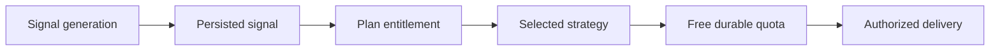

# Entitlement Architecture

The Go engine generates qualified signals independently. Distribution authorization is a control-plane concern:

`control.plan_entitlements` is the existing capability source. `control.strategy_preferences` stores the user choice. The backend validator in `control/src/modules/subscriptions/entitlement-policy.ts` is authoritative; frontend restrictions are advisory only.

