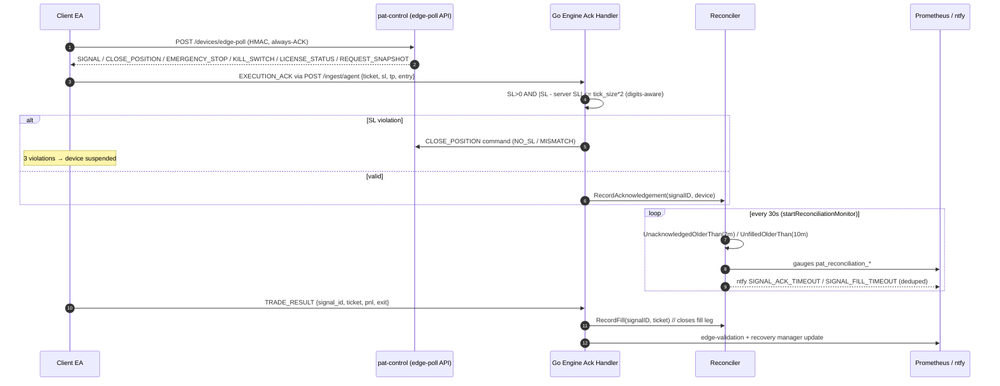
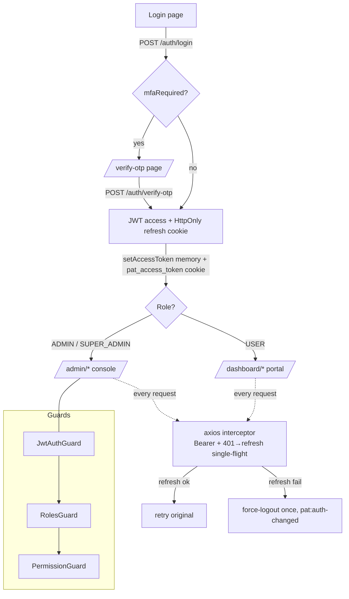
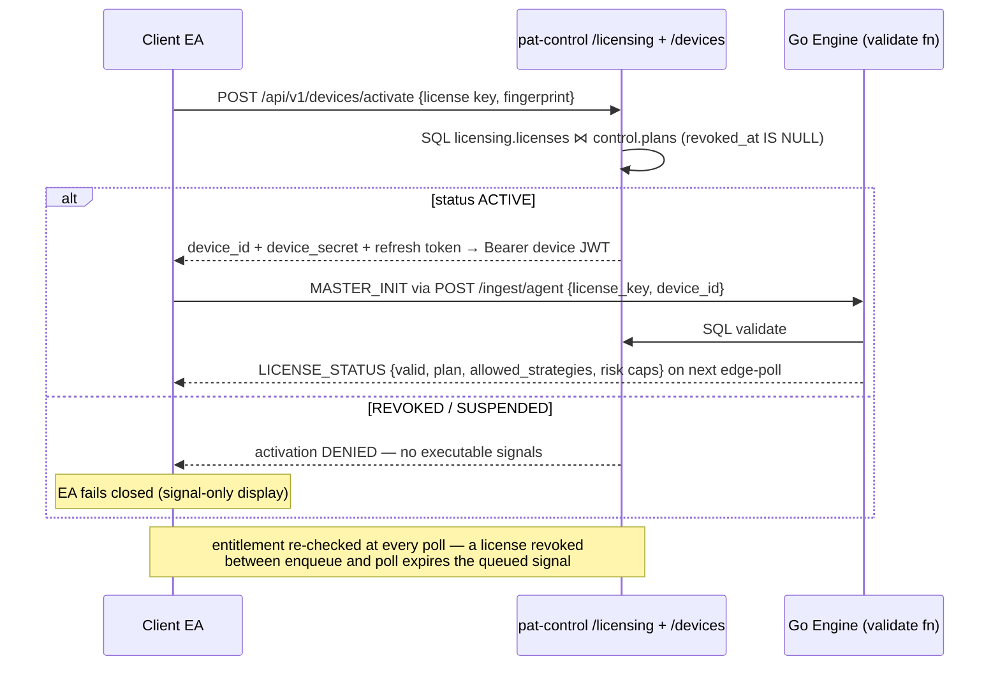
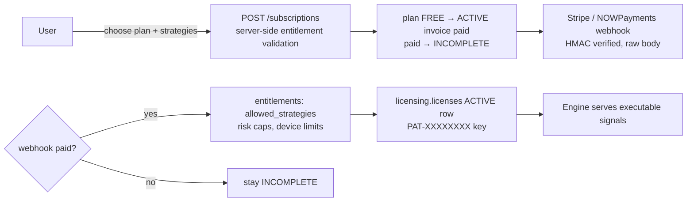
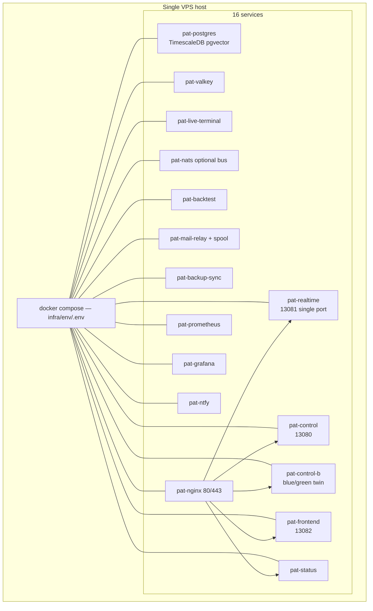
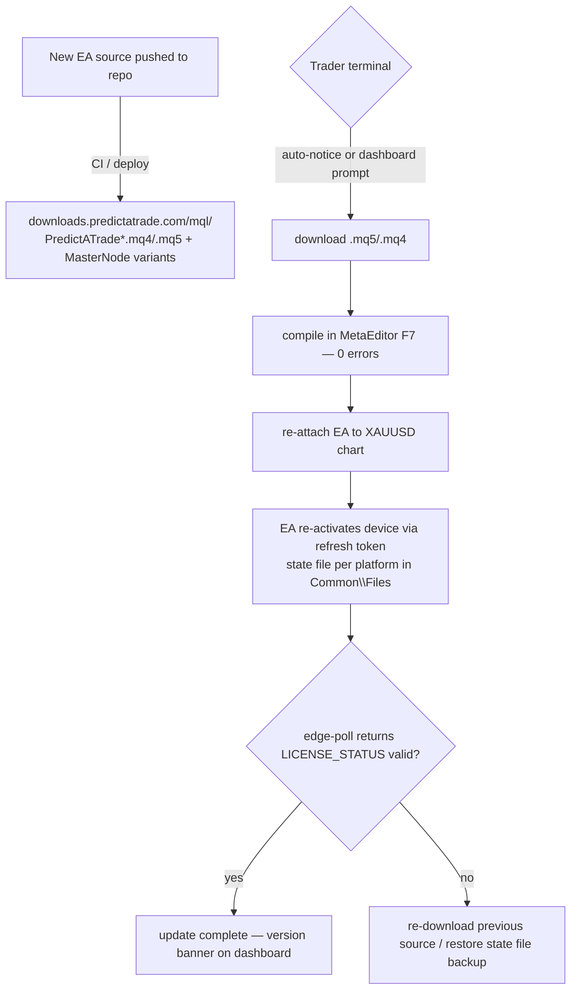
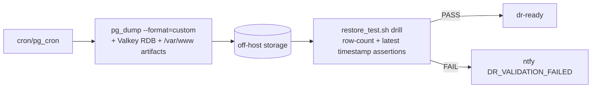

# Architecture Flow Diagrams
## v1.29.0 — 05 September 2026

Authoritative visual reference for the runtime flows of Predict-A-Trade. All diagrams are
[Mermaid](https://mermaid.js.org/) — rendered natively on the docs site (docsify-mermaid) and
GitHub. Truth sources: `realtime/cmd/realtime-engine/main.go`, `control/src/**`,
`nginx/sites-available/*.conf`, `mql/` EA sources. All diagrams reflect the v1.19+ Option B
EA-direct transport (Windows Agent removed).

---

## 1. System Plane Overview

```mermaid
flowchart TD
    subgraph Edge["Windows / MQL Edge"]
        EA_M[Master Node EA<br/>POST /ingest/agent<br/>MARKET_SNAPSHOT + ticks]
        EA_C[Client EA<br/>HMAC edge-poll + order execution]
    end

    subgraph Nginx["Nginx edge (80/443 TLS)"]
        NG[[api.predictatrade.com<br/>/api/v1 router + /ingest/agent]] 
        NG2[[platform.predictatrade.com<br/>frontend + /ws]]
        NG4[[downloads.predictatrade.com<br/>EA .mq4/.mq5 sources]]
    end

    subgraph Go["Go Realtime Plane — pat-realtime :13081 (single port)"]
        GW[Gateway HTTP+WS]
        ING[Ingest Bus<br/>DirectBus / NatsBus]
        FEAT[Feature Registry<br/>42 indicators]
        STRAT[Strategy Engines x7]
        GATES[16 Hard Gates<br/>fail-closed]
        SIG[Signal Engine + Calibration]
        RECON[Reconciliation<br/>ACK + fill legs]
        PERS[(TimescaleDB)]
        VAL[(Valkey)]
    end

    subgraph Nest["NestJS Control Plane — pat-control :13080"]
        IAM[IAM / MFA / RBAC]
        SUB[Subscriptions / Billing<br/>Stripe + NOWPayments]
        LIC[Licensing / Devices]
        FIN[Commissions / Payouts]
        OPS[Operations / Feature flags]
        AUD[Audit / GDPR]
    end

    subgraph FE["Next.js Presentation — pat-frontend :13082"]
        ADMIN[Admin Console 25 pages]
        USER[User Portal 19 pages]
    end

    subgraph Data[(Datastores)]
        PG[(PostgreSQL 17 +<br/>TimescaleDB, pgvector)]
        VK[(Valkey 8)]
    end

    EA_M -- "POST /ingest/agent (Bearer device JWT)" --> NG --> :13081 --> GW --> ING
    GW --> ING --> FEAT --> STRAT --> GATES --> SIG
    SIG --> PERS & VAL
    EA_C -- "POST /api/v1/devices/edge-poll (HMAC, every ~3s)" --> NG
    NG -- "SIGNAL / CLOSE_POSITION / EMERGENCY_STOP / KILL_SWITCH / LICENSE_STATUS / REQUEST_SNAPSHOT" --> EA_C
    EA_C -- "EXECUTION_ACK / TRADE_RESULT (via /ingest/agent)" --> ING
    SIG -- "executable signals → licensing.edge_signal_queue (fail-closed, plan-filtered)" --> PERS
    RECON -- "gap alerts" --> NTFY[ntfy + Prometheus]

    ADMIN & USER -- "https://api…/api/v1 (JWT)" --> NG --> IAM & SUB & LIC & FIN & OPS & AUD
    IAM & SUB & LIC & FIN & OPS & AUD --> PG
    PERS --- PG
    VAL --- VK
```

---

## 2. Tick → Signal Lifecycle (realtime hot path)

```mermaid
sequenceDiagram
    autonumber
    participant MT as MT5 Master Node EA
    participant E as Go Engine (DirectBus)
    participant F as Feature Registry
    participant S as Strategy Engines
    participant G as 16 Hard Gates
    participant C as Calib Consumer
    participant R as Reconciler

    MT->>E: POST /ingest/agent — MASTER_TICK / MARKET_SNAPSHOT (Bearer device JWT)
    E->>F: aggregate candle (M1..MN)
    F->>S: MarketState (42 indicators + regime)
    S->>G: candidate + geometry (SL/TP1..3, R:R)
    G-->>S: veto per gate (ordered, fail-closed) OR pass
    S->>C: RAW_SCORE → calibrated prob (VALIDATED models only)
    C-->>S: prob | "Pending" (never fabricated)
    alt all gates pass AND executable
        S->>R: enqueue licensing.edge_signal_queue (plan-filtered in SQL)
        Note over R: per-device delivery tracking
    else
        S-->>E: NO-TRADE (first-class) persisted w/ reasons
    end
    Note over E: broker TimeCurrent() is the sole trading clock;<br/>time_mode BROKER_ALIGNED via live DST-adaptive bridge
```

---

## 3. Execution Ack & Fill Reconciliation (BE-6)



---

## 4. Authentication & Session Flow



Notes: privileged roles (`ADMIN`, `SUPER_ADMIN`, `OPERATOR`) must enroll MFA before login
completes (`mfaEnrollmentRequired`).

---

## 5. Licensing / Device Activation Flow



---

## 6. Payment → Entitlement Flow



---

## 7. Deployment Topology (Docker-first, no systemd)



---

## 8. EA Update / Rollback Flow (Option B — no local binaries)



---

## 9. Backup / DR Flow



---

## Traceability

| Flow | Source of truth |
|---|---|
| Signal lifecycle | `realtime/internal/reconciliation/reconciler.go`, `cmd/realtime-engine/main.go` |
| Ack enforcement | `main.go` EXECUTION_ACK handler (SL verify + CLOSE_POSITION) |
| Auth | `control/src/modules/auth/*`, `frontend/src/lib/auth.ts`, `frontend/src/proxy.ts` |
| Licensing | `control/src/modules/licensing/*`, engine `SetLicenseValidateFn` |
| Payments | `control/src/modules/billing/*`, `subscriptions.service.ts` |
| Updates | `mql/` EA sources → `downloads.predictatrade.com/mql/` (nginx `mql/` mount); MetaEditor F7 recompile |
| Backup | `scripts/backup/*`, `infra/env` cron |