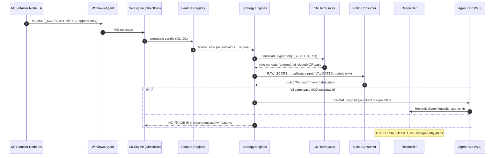
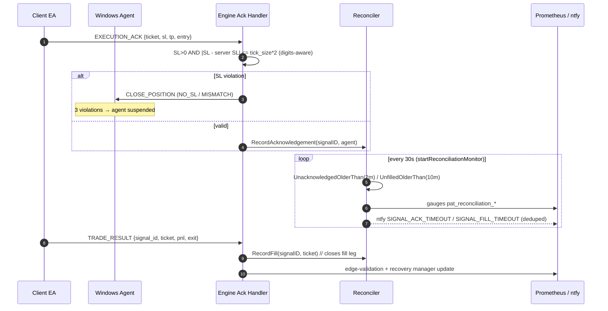
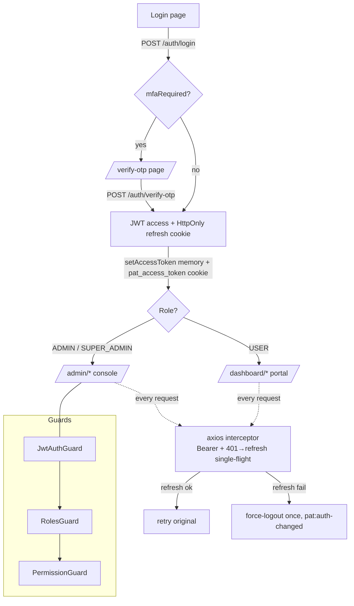
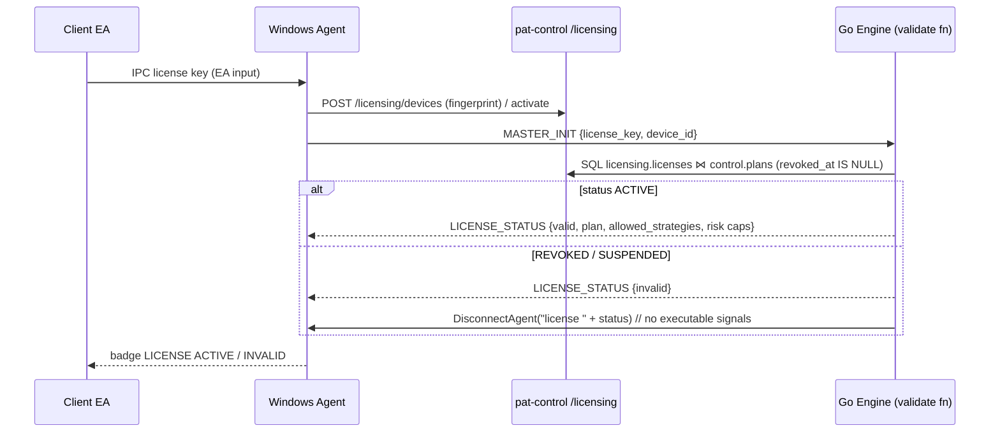
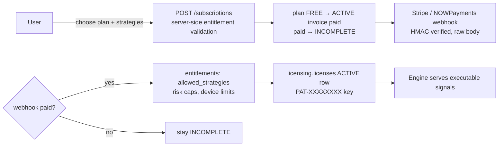
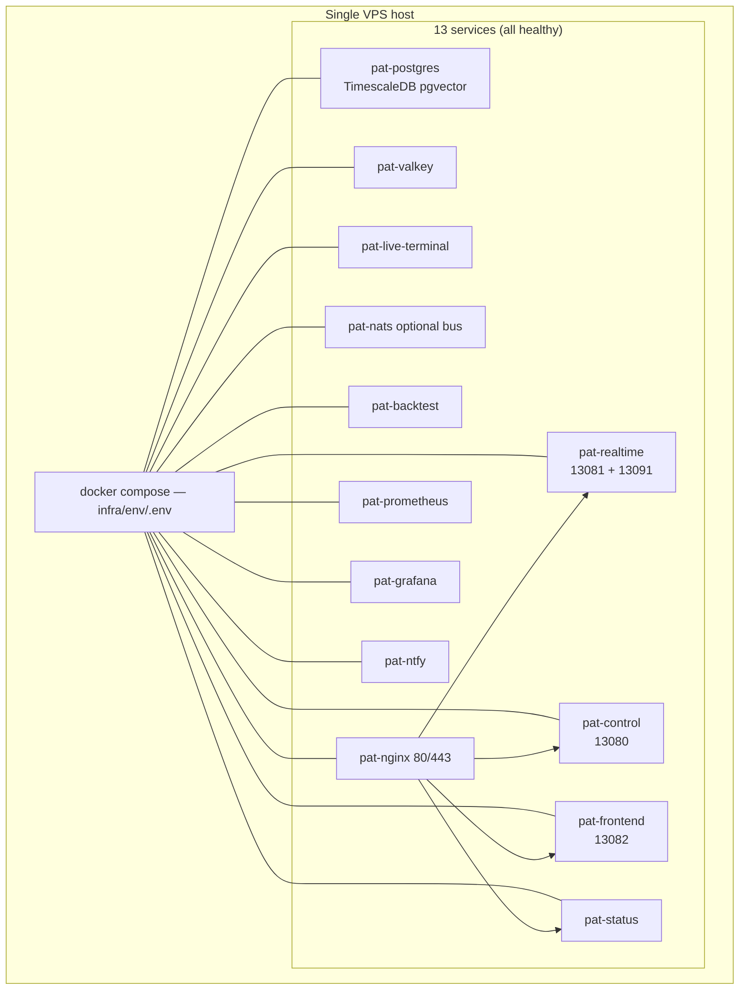
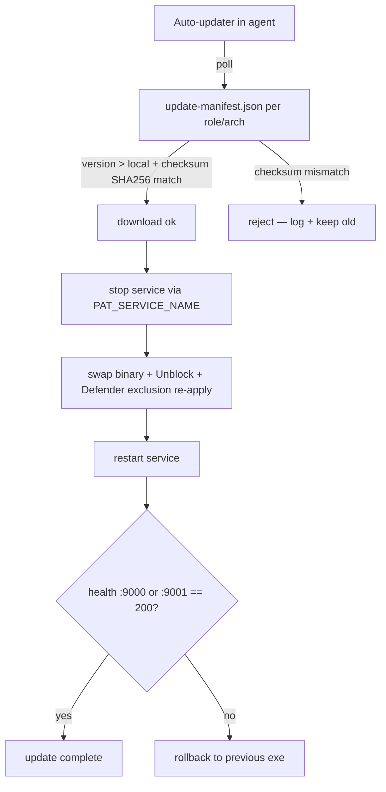
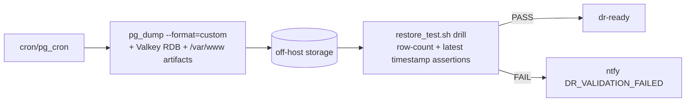

# Architecture Flow Diagrams
## v1.17.4 — 30 August 2026

Authoritative visual reference for the runtime flows of Predict-A-Trade. All diagrams are
[Mermaid](https://mermaid.js.org/) — rendered natively on the docs site (docsify-mermaid) and
GitHub. Truth sources: `realtime/cmd/realtime-engine/main.go`, `control/src/**`,
`nginx/sites-available/*.conf`, `windows-agent/deploy/install.ps1`.

---

## 1. System Plane Overview

```mermaid
flowchart TD
    subgraph Edge["Windows / MQL Edge"]
        EA_M[Master Node EA<br/>MARKET_SNAPSHOT + ticks]
        EA_C[Client EA<br/>order execution]
        WS[Windows Agent v1.2.40<br/>pat-master.exe + pat-agent.exe<br/>services :9001 / :9000]
        EA_M <-->|file IPC PAT_master_data.txt| WS
        WS <-->|file IPC / pipes| EA_C
    end

    subgraph Nginx["Nginx edge (80/443 TLS)"]
        NG[[api.predictatrade.com<br/>/api/v1 router]] 
        NG2[[live.predictatrade.com<br/>ws/v1/agent + ws/v1/data]]
        NG3[[platform.predictatrade.com<br/>frontend + /ws]]
        NG4[[downloads.predictatrade.com<br/>agent/EA artifacts]]
    end

    subgraph Go["Go Realtime Plane — pat-realtime :13081/:13091"]
        GW[Gateway HTTP+WS]
        ING[Ingest Bus<br/>DirectBus / NatsBus]
        FEAT[Feature Registry<br/>42 indicators]
        STRAT[Strategy Engines x5]
        GATES[16 Hard Gates<br/>fail-closed]
        SIG[Signal Engine + Calibration]
        RECON[Reconciliation<br/>ACK + fill legs]
        PERS[(TimescaleDB)]
        VAL[(Valkey)]
    end

    subgraph Nest["NestJS Control Plane — pat-control :13080"]
        IAM[IAM / MFA / RBAC]
        SUB[Subscriptions / Billing<br/>Stripe + NOWPayments]
        LIC[Licensing / Devices]
        FIN[Commissions / Payouts]
        OPS[Operations / Feature flags]
        AUD[Audit / GDPR]
    end

    subgraph FE["Next.js Presentation — pat-frontend :13082"]
        ADMIN[Admin Console 25 pages]
        USER[User Portal 19 pages]
    end

    subgraph Data[(Datastores)]
        PG[(PostgreSQL 17 +<br/>TimescaleDB, pgvector)]
        VK[(Valkey 8)]
    end

    EA_M -- "wss://live…/ws/v1/data" --> NG2 --> :13091 --> ING
    WS -- "wss://live…/ws/v1/agent" --> NG2 --> :13081 --> GW
    GW --> ING --> FEAT --> STRAT --> GATES --> SIG
    SIG --> PERS & VAL
    SIG -- "SIGNAL (per-client risk filter)" --> WS --> EA_C
    EA_C -- "EXECUTION_ACK / TRADE_RESULT" --> WS --> RECON
    RECON -- "gap alerts" --> NTFY[ntfy + Prometheus]

    ADMIN & USER -- "https://api…/api/v1 (JWT)" --> NG --> IAM & SUB & LIC & FIN & OPS & AUD
    IAM & SUB & LIC & FIN & OPS & AUD --> PG
    PERS --- PG
    VAL --- VK
```

---

## 2. Tick → Signal Lifecycle (realtime hot path)



---

## 3. Execution Ack & Fill Reconciliation (BE-6)



---

## 4. Authentication & Session Flow



Notes: privileged roles (`ADMIN`, `SUPER_ADMIN`, `OPERATOR`) must enroll MFA before login
completes (`mfaEnrollmentRequired`).

---

## 5. Licensing / Device Activation Flow



---

## 6. Payment → Entitlement Flow



---

## 7. Deployment Topology (Docker-first, no systemd)



---

## 8. Update / Rollback Flow (Windows Agent)



---

## 9. Backup / DR Flow



---

## Traceability

| Flow | Source of truth |
|---|---|
| Signal lifecycle | `realtime/internal/reconciliation/reconciler.go`, `cmd/realtime-engine/main.go` |
| Ack enforcement | `main.go` EXECUTION_ACK handler (SL verify + CLOSE_POSITION) |
| Auth | `control/src/modules/auth/*`, `frontend/src/lib/auth.ts`, `frontend/src/proxy.ts` |
| Licensing | `control/src/modules/licensing/*`, engine `SetLicenseValidateFn` |
| Payments | `control/src/modules/billing/*`, `subscriptions.service.ts` |
| Updates | `windows-agent/internal/updater.go`, `deploy/install.ps1` |
| Backup | `scripts/backup/*`, `infra/env` cron |