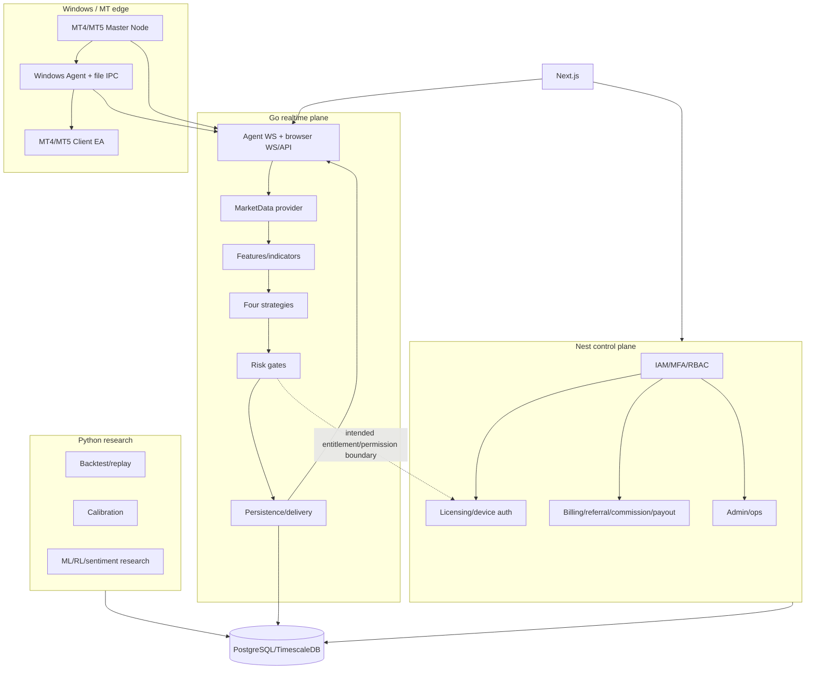
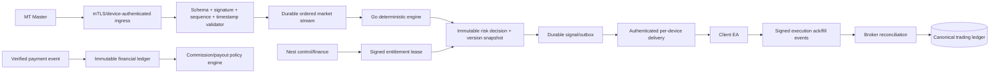

# Predict-A-Trade Forensic Engineering Audit

**Audit date:** 2026-08-19  
**Repository:** `/srv/predictatrade/xauusd`  
**Mode:** read/analyze/trace/report only  
**Disposition:** **BLOCKED / production NO-GO**

This report is based on the repository contents, executable source, configuration, migrations, tests, deployment artifacts, and documentation present at audit time. No project implementation was modified. The only requested repository write is this report. Existing worktree changes were preserved and treated as pre-existing evidence.

## 1. Executive Summary

Predict-A-Trade today is a partially integrated XAUUSD market-data and deterministic technical-signal platform with a functioning Go realtime process, a broad but inconsistently wired NestJS control plane, a substantial Next.js presentation surface, Python research/backtesting code, and Windows/MQL adapters. It is not yet an institutionally credible production trading or financial SaaS system.

The live signal path is materially narrower than the product documentation claims:

```mermaid
flowchart LR
  EA[MT4/MT5 Master EA] -->|unauthenticated WebSocket| AG[Go AgentHub]
  AG --> AP[AgentProvider]
  AP -->|gateway timestamp; source timestamp discarded| RT[Go realtime engine]
  RT --> N[normalization + aggregation]
  N --> F[local indicators/features]
  F --> S[one of four deterministic strategies]
  S --> D[raw score + structural SL/TP]
  D --> G[12-gate registry]
  G -->|confirmed signal only| P[persistence/delivery]
  G -->|NO_TRADE / veto| NT[no-trade result]
  P --> WS[Go WebSocket/API]
  WS --> WA[Windows Agent]
  WA --> IPC[file IPC]
  IPC --> EA2[MT4/MT5 client EA]
```



The actual critical defects are not cosmetic:

1. Live `signal.Engine.Decide` receives no ATR and sets ATR to zero, so the spread/ATR risk gate is bypassed; only absolute spread is evaluated (`realtime/cmd/realtime-engine/main.go:775-791`, `realtime/internal/signal/engine.go:118-140`).
2. Go agent ingestion accepts arbitrary WebSocket clients, arbitrary `agentId`, arbitrary JSON snapshots, and any origin; no JWT, device credential, signature, freshness, sequence, or source arbitration is enforced (`realtime/internal/gateway/agent_ws.go:40-44,72-87`, `realtime/internal/marketdata/agent_provider.go:267-481`).
3. Browser/API Go routes and signal resume are not protected by Go authentication middleware. Resume accepts a caller-supplied `device_id` and returns valid signals (`realtime/internal/gateway/http.go:257-350`).
4. Calibration seeds active default models with hardcoded sample and quality metrics rather than verified training artifacts (`realtime/internal/calibration/consumer.go:81-105`). The subscriber probability is therefore not production evidence of a calibrated event probability.
5. The active score path is hardcoded strategy evidence, while the versioned confluence profiles, macro evidence, and PTB/advanced managers are not consistently connected to that path. Python and Go strategy profiles disagree.
6. Billing webhook handling only logs and acknowledges. Commission calculation is a standalone class, not demonstrated as an event-driven ledger workflow. Payout code inserts `amount` and `created_at` into a schema that defines `requested_amount` and does not define `created_at` in the same contract (`control/src/modules/billing/billing.service.ts:20-23`, `control/src/modules/payouts/payouts.service.ts:16-23`, `database/migrations/004_referral_commission_payout.sql:257-280`).
7. MQL master nodes use the current forming bar and shift-zero indicators; this creates repainting/signal-timing risk (`mql/mt5/PredictATrade_MasterNode_MT5.mq5:369,459`, corresponding MT4 code). Windows/file IPC is polling, truncating, and lossy.
8. The repository contains 18 migrations, while README/MANIFEST claim 13/15; migration 017 embeds production-specific identity/account data, and migration 018 references `control.audit_log` only conditionally. Migration validity against a clean database was **NOT VERIFIED** in this audit.
9. The executable evidence is mixed: Go realtime race tests and vet pass; frontend typecheck/build/tests pass; Python tests pass only under `python3`; Nest tests fail 11 tests; frontend lint fails 22 errors; the Makefile’s standard research command calls unavailable `python`; the claimed “490 tests, 0 failures” is not reproducible from the current tree.

**Final verdict:** production **NO-GO**. The system may be used only as a controlled development, replay, paper, or shadow environment until P0 security, data provenance, risk-gate, financial-ledger, migration, execution, and validation controls are closed with evidence.

## 2. Project Purpose & Product Definition

The SOW and README describe a four-plane product:

| Plane | Intended responsibility | Evidence in repository | Audit conclusion |
|---|---|---|---|
| Go realtime | authoritative XAUUSD data, features, strategy, risk, signal delivery | `realtime/cmd/realtime-engine`, `realtime/internal/*` | Core exists and runs, but security/provenance/risk wiring is incomplete |
| Python research | datasets, backtests, walk-forward/OOS, calibration, ML research | `research/src/patresearch`, `research/tests` | Research framework exists; live promotion/parity evidence is not established |
| NestJS control | IAM, MFA/RBAC, plans, billing, licensing, referrals, finance, admin | `control/src/modules/*` | IAM and CRUD surface exist; financial integrations/workflows are partial |
| Next.js presentation | public/user/admin/live command center | `frontend/src/app`, `frontend/src/components` | Broad UI shell exists; data authority/auth/realtime honesty gaps remain |

What it claims to be: a production-grade XAUUSD intelligence, signal, licensing, subscription, referral, execution-adapter, and command-center platform with four distinct strategies, hard risk gates, calibrated probabilities, live data provenance, and institutional release gates.

What it is: a working deterministic technical signal prototype with extensive scaffolding and a sizeable schema/UI/control surface, connected to MT/Windows through an unauthenticated and lossy transport path, with research and advanced intelligence mostly shadow, optional, or not live-wired.

## 3. Complete Repository/File Inventory

The recursive inventory at audit time contained **689 files** excluding `.git`, including approximately 126 TSX, 112 TypeScript, 104 Go, 92 Markdown, 43 Python, 18 SQL, 51 SVG, and 48 PNG files. Top-level implementation/documentation areas are:

| Area | Contents examined |
|---|---|
| `.agents`, `.codex` | repository skills, project agents/configuration |
| `.github` | workflows and repository automation |
| `control` | NestJS source, tests, package manifests, compiled artifacts |
| `database` | migrations, schema-related artifacts, backup/restore scripts |
| `docs` | architecture, SOW, strategy, data provenance, operations, database, security, validation and status docs |
| `frontend` | Next.js routes/components/providers/lib/tests/generated schema and build configuration |
| `frontend_backup_20260818_225025` | backup frontend tree; duplicate/legacy surface |
| `infra` | Docker Compose, Nginx, systemd, Prometheus/Grafana and environment templates |
| `mql/mt4`, `mql/mt5` | master-node and client EAs |
| `realtime` | Go command, internal packages, web assets, tests and module files |
| `research` | Python package, backtesting, calibration, ML, datasets/adapters and tests |
| `scripts` | migration, backup, Windows and operational scripts |
| `status` | status/health service |
| `windows-agent` | Go Windows agent, IPC, authentication, updater and tests |
| root control files | `AGENTS.md`, `AGENT.md`, `SKILLS.md`, `README.md`, `MANIFEST.md`, `Makefile`, SOW copies, env examples, compose and project reports |

Notable inventory risks:

- Existing `node_modules`, `.next`, `control/dist`, and `realtime/bin` artifacts obscure a clean-source boundary.
- Configured project subagent roles were attempted for bounded exploration, but the execution environment rejected them because the configured role model (`kimi-k2.7-code:cloud`) was unavailable. No delegated findings were used; the audit was completed by direct local inspection and executable checks.
- `frontend_backup_20260818_225025` duplicates frontend implementation and increases ambiguity about the deployed surface.
- `database_url.txt`, `jwt_secret.txt`, `.env.local`, and `mcp.env` exist in the workspace. They are mode 600/644 as observed; `.gitignore` entries exist, but secret rotation and leak history were **NOT VERIFIED**.
- A root `PRODUCTION_FULL_AUDIT_REPORT.md` already exists and is untracked; its conclusions conflict with executable audit evidence and was not treated as authority.
- The repository is substantially dirty: 267 status entries were observed. Changes were not attributed to this audit.

## 4. Technology Stack & Dependency Map

| Component | Technology | Runtime/dependency evidence |
|---|---|---|
| Realtime | Go, Gorilla WebSocket, pgx, shopspring/decimal, Prometheus/OpenTelemetry-related code | `realtime/go.mod`, `cmd/realtime-engine`, `internal` |
| Control | NestJS 10, TypeScript, PostgreSQL `pg`, JWT, bcrypt, otplib, throttler, Swagger, prom-client, decimal.js | `control/package.json`, `src/main.ts`, `app.module.ts` |
| Presentation | Next.js 16.3.1, React/TypeScript, Tailwind-style token CSS, Axios/Jest | `frontend/package.json`, `next.config.ts` |
| Research | Python 3, NumPy, pandas, SciPy, scikit-learn, pytest, ruff | `research/pyproject.toml` |
| Database | PostgreSQL/TimescaleDB/pgvector claims; SQL migrations use PostgreSQL features | `database/migrations`, `docker-compose.yml` |
| Cache | Valkey/Redis-compatible cache claimed and used by Go | `docker-compose.yml`, realtime persistence/config |
| Edge | Go Windows Agent, MQL4/MQL5 file IPC and WebSocket adapters | `windows-agent`, `mql` |
| Ops | Docker Compose, Nginx, systemd, Prometheus/Grafana | `infra/*`, `Makefile` |

Dependency and provider routing are not fully authoritative. There is no verified payment-provider SDK, no demonstrated live LLM/MCP client in the signal path, and no verified production artifact registry or signed-release trust root.

## 5. High-Level Architecture



The architecture boundary is conceptually sound: finance should not be synchronous in tick-to-signal processing, and the Go plane does not visibly call Nest on every tick. The actual security and data-authority boundaries are weak because Go endpoints and agent transport bypass control-plane authentication, and Go seeds/accepts several control states locally.

## 6. Detailed End-to-End Runtime Flow

1. `main.go` loads defaults and environment configuration. A parsed `configPath` is ignored (`realtime/cmd/realtime-engine/main.go:43-51`).
2. PostgreSQL failure is logged and the process continues without persistence (`main.go:57-69`). This favors availability but can produce an apparently healthy non-durable trading service.
3. Provider mode defaults to `agent`; simulated mode is intended for development. A simulated base price is present in config (`realtime/internal/config/config.go:60-66,130-139`).
4. A snapshot is accepted, bars are reconstructed with `time.Now().UTC()` and `IsClosed:false`, losing the original bar timestamp/closure semantics (`main.go:152-164`).
5. Broker account data hydrates exposure/margin/execution gate state. Exposure is marked PASS based on open-position count; margin state can be marked PASS even when `marginOK` is false, although the live gate may later veto (`main.go:192-243`).
6. Agent connection/heartbeat also marks execution permission PASS (`main.go:245-275`). Connection is therefore treated as permission evidence.
7. Tick messages are normalized and passed through a stale detector, but the detector is not used by the five-second gate-state refresh (`main.go:508-544,888-950`).
8. Candles update state and run the feature registry. Indicators are locally calculated; computed local values are labeled `AUTHORITATIVE` with `Source: local_compute` (`main.go:546-617`).
9. PTB evaluates after the feature registry, but `dataSource` is hardcoded to `LiveMasterNode`. This can label non-live/unknown input live (`main.go:580`). PTB modules default SHADOW and contribute zero.
10. Each strategy evaluates the merged state. Raw score is calibrated and passed to the signal engine (`main.go:618+`).
11. The signal engine builds gate input, but ATR is zero in the active call path (`main.go:775-791`, `signal/engine.go:118-140`).
12. Confirmed BUY/SELL or NO_TRADE results are created. The main flow does not show durable persistence/delivery for every generated signal; inspectable persistence helpers and tables exist, but actual call coverage is incomplete.
13. Go broadcasts market/signal events. Browser clients are filtered by entitlements that are not populated during the shown handshake (`gateway/websocket.go:57-69,147-170`).
14. Windows Agent connects using an unauthenticated query-string WebSocket (`windows-agent/internal/agent.go:305-311`).
15. Agent writes signal messages to `PAT_signals.txt`; MQL clients poll and execute if `AutoExecute` is enabled. The client-side order math is independent of server risk sizing.

## 7. Data Flow & Data Lineage

The intended lineage is `broker tick -> agent -> Go -> features -> strategy -> gate -> signal -> delivery -> client`. The implemented lineage has these breaks:

| Stage | Verified behavior | Lineage defect |
|---|---|---|
| Broker tick | MQL/agent sends JSON | no signature, sequence, authenticated source |
| Timestamp | Go uses gateway `time.Now()` | MQL timestamp is discarded; latency and replay ordering cannot be measured |
| Bars | reconstructed from snapshot | source time/closed state lost; current bar is used |
| Indicators | local Go + MQL values | local computed values mislabeled authoritative; parity not proven |
| Volume/flow | tick volume/derived proxies | no centralized spot volume; COT is GC futures and must not be treated as spot flow |
| Macro | COT/DXY providers exist | strategy evidence does not consistently consume it; DXY is primarily PTB correlation |
| State | mutable pointers returned after lock | callers mutate shared state outside lock (`features` state manager) |
| Signal | version fields exist | actual versions/config snapshots are not consistently persisted/attached |
| Delivery | WS queues and DB replay endpoint exist | P0/P1 messages can be default-dropped; resume is unauthenticated |
| Execution | client EA sends broker order | server intent, broker fill, partial close and reconciliation are not a closed authoritative loop |

The repository correctly contains `DataSourceType`, quality fields, and PTB authenticity guards, but those semantics are not enforced at the agent ingress boundary or consistently carried through the active path.

## 8. Module-by-Module Analysis

### Go realtime

- `cmd/realtime-engine/main.go`: orchestration, provider lifecycle, state loops, strategy loop, persistence hooks. Strength: single low-latency process boundary. Weakness: ignored config path, fallback without persistence, hardcoded inputs, goroutine-per-tick persistence, stale-state refresh flaws, mutable state pointers.
- `internal/marketdata`: provider abstractions and normalization exist. Agent provider accepts untrusted snapshots, overwrites state from multiple agents, uses gateway timestamps and channel drops.
- `internal/features`: broad indicator/structure/MTF registry exists. Warm-up zeros and current-bar inputs are not consistently represented as unavailable; quality is metadata more than a score veto.
- `internal/strategy`: four distinct names and structural exits exist. Actual scoring is evidence sum with conflict penalty; config/profile versioning is not the sole authority.
- `internal/gates`: twelve gates and fail-closed missing-state logic exist. Several cached states are optimistic or stale, and active ATR input is zero.
- `internal/signal`: deterministic gate-to-signal construction exists; no net-expectancy calculation beyond gross R:R and cost fields.
- `internal/calibration`: interface and sigmoid calibration exist; seeded active defaults are not an empirical deployment artifact.
- `internal/ptb`, `recovery`, `adaptation`, `hedging`, `rl`, `sentiment`: substantial implementations/tests exist, but PTB is shadow and `DecideWithAdvanced` is not called by the production main flow.
- `internal/gateway`: versioned envelopes exist, but auth, entitlements, origin, backpressure, and replay controls are incomplete.
- `internal/observability`: metrics are present, but end-to-end SLO dashboards/alerts and alert validation are not verified.

### NestJS control plane

IAM, MFA, refresh rotation, RBAC-shaped modules, licensing/device activation, plans, subscriptions, admin and audit controllers exist. The critical missing path is canonical financial event processing: billing webhook is a logger/acknowledger; commission engine is not shown wired to validated payment events; payout transitions do not reserve balances or write a ledger.

### Next.js

The route/component inventory is broad and includes user/admin/command-center surfaces. Typecheck, build, and tests pass. The UI still contains hardcoded market defaults (`frontend/src/components/trading/live-dashboard.tsx:38-59`), API/WS defaults inconsistent with deployed ports (`frontend/next.config.ts`, `frontend/src/lib/axios-instance.ts`), and lint failures. It must remain a renderer of backend truth; currently some empty/loading states can look like live prices.

### Python research

Backtesting, multi-timeframe alignment, execution simulation, calibration and ML research are real code, not only documentation. The research suite is not evidence that a model is approved for live use. Synthetic data dominates tests. ATR update logic uses current candle close as previous close, losing gap behavior (`research/.../backtesting`), and Go/Python strategy parameters diverge.

### Windows/MQL

The adapters support activation, heartbeat, signal receipt, deduplication and optional execution. They are not safe institution-grade execution adapters: transport authentication is absent, IPC is file polling/truncation, update signatures are not verified, client lot/risk logic is independent, and current-bar indicator values can repaint.

## 9. Trading/Signal Generation Pipeline

The active strategy formula is approximately:

```text
long_score  = 100 * sum(long evidence contribution)
short_score = 100 * sum(short evidence contribution)
score = max(long_score, short_score) - conflict_penalty
direction = dominant side only if score > strategy minimum confluence
```

The strategy then computes entry from current mid and structural SL/TP using structure plus ATR buffers (`realtime/internal/strategy/strategies.go:149-198`). This is not a probability model, and the score does not itself mean probability.

The signal engine applies gates, status and expiry. A non-BUY/SELL result is represented as DETECTED/NO_TRADE-style output depending on path (`realtime/internal/signal/engine.go:74-221`). The main no-trade helper uses a fixed 15-minute expiry, even though strategy expiries vary (`main.go:982-1010`).

## 10. Indicator & Feature Inventory

Verified Go/local indicators include EMA 9/21/50/100/200, SMA 50/100/200, MACD, ADX, RSI, stochastic, CCI, ATR, Bollinger, OBV, VWAP, SAR, Ichimoku, StochRSI, Fibonacci, pivots, rolling z-scores, MTF alignment, regime, sessions, structure, liquidity, FVG and related derived fields. MQL master nodes also calculate common indicators. Python precomputation mirrors only a subset.

Important quality concerns:

- OBV uses broker/tick volume, not centralized XAUUSD volume.
- MQL shift-zero values and current bars can change after the fact.
- Go snapshot bar timestamps are replaced with receipt time.
- insufficient history often becomes numeric zero instead of a first-class unavailable state.
- local indicator outputs are labeled authoritative despite local derivation.
- feature quality is stored but does not consistently suppress score contributions.

## 11. Strategy/Market-Structure Logic

The four declared strategies are present: `STANDARD_SCALPING`, `ULTRA_SCALPING`, `STANDARD_SWING`, and `TREND_SWING`. Their Go configurations are distinct in timeframe, ATR exits, expiry, cooldown, and confluence thresholds. `scoreDirection` is deterministic and uses evidence contributions plus conflict penalty.

The documented confluence profile thresholds/weights and lowercase pillar keys in `internal/strategy/confluence.go` do not match the uppercase evidence family keys and hardcoded thresholds in `strategies.go`; the profile evaluator is not shown as the active scorer. The documents claim DXY/COT/yield pillars for swing strategies, but the live strategy implementations principally consume local technical state. This is a material “claimed versus active” discrepancy.

## 12. AI/ML/MCP/Agent Architecture and Model Routing

No verified LLM, MCP, GPT, Claude, or external AI inference call is in the live Go signal path. “Agent” primarily means the Windows market-data/execution adapter. ML adaptation, RL, sentiment, and advanced decision APIs are pluggable/shadow/testable but not demonstrated as live production model routing.

The calibration consumer is the only direct subscriber-facing probability transform identified. It clamps raw score and applies a sigmoid; when no model is available it uses a linear fallback. `SeedDefaultModels` creates active model records with fixed target/metrics/sample values. Those values must be treated as placeholders until linked to immutable training data, OOS evaluation, calibration curves, artifact hashes, and promotion approvals.

## 13. Signal Scoring/Probability/Confidence Mathematics

Verified mathematics:

- strategy score: weighted evidence contribution multiplied to a 0–100-like scale, conflict penalty, threshold comparison;
- raw score is not a probability;
- calibration: bounded sigmoid/linear fallback in `internal/calibration/consumer.go`;
- R:R: gross target distance divided by stop distance; cost fields are not fully incorporated into the acceptance formula;
- Python calibration includes Brier/ECE/Wilson/sample-sufficiency utilities.

Not verified:

- a production target definition covering TP1/SL, multi-target exits, horizon, costs and active exit profile;
- independent calibration/OOS data and confidence intervals for the seeded models;
- parity between Go and Python probability output;
- statistical sufficiency of live samples;
- probability calibration by strategy, regime, broker, session and execution class.

Therefore the UI/API field `calibrated_probability` must not be marketed as a validated probability without an evidence package.

## 14. Risk Management & Execution Logic

The twelve gate IDs are data quality, session, news, spread, slippage, total cost, exposure, margin, R:R/net expectancy, entitlement, license and execution permission. The registry is fail-closed for missing required state. This is a strong structural choice.

The implementation nevertheless has P0/P1 defects:

- ATR is zero in active gate input, bypassing spread/ATR.
- data quality refresh marks PASS merely because state exists, without checking freshness/quality/timestamp.
- session cached state is PASS regardless of actual session; live evaluation depends on input.
- safety windows can be refreshed from an already optimistic PASS state.
- exposure is count-based rather than broker-economics-based aggregate XAUUSD exposure.
- margin gate is a boolean and does not demonstrate headroom, stop-out, free margin, or broker-specific economics.
- execution permit derives from connection/account hydration.
- MQL lot sizing uses client balance and a fixed 1% risk fallback, not an authoritative server execution plan.
- broker symbol, digits, tick value, contract size, min/max/step, stops/freeze/fill modes and margin rules are not verified end-to-end for each execution class.
- the Go path does not demonstrate closed-loop order, fill, partial-close, rejection, reconciliation and idempotent compensation.

## 15. MT4/MT5/Windows Agent Architecture

MT4/MT5 master EAs publish market snapshots through common-folder files to the Windows Agent. The Agent forwards them by WebSocket to Go and receives signals back. Client EAs poll signal files, check local flags/license, deduplicate the signal ID, and optionally call `trade.Buy`/sell.

The transport is weak:

- Go AgentHub allows all origins and no authentication.
- Agent URL contains an identifier but no access token.
- device access token is not placed in heartbeat or WebSocket headers (`windows-agent/internal/agent.go:207-224,305-311`).
- MQL writes use `FILE_WRITE`, which can replace/truncate shared files; the Go reader also reads then truncates (`windows-agent/internal/pipe.go:124-148`).
- bounded channels drop ticks/signals on pressure.
- updater has a `Signature` field marked “future” and only verifies SHA-256 (`windows-agent/internal/updater.go:26-34,122-127`).
- device key generation/storage does not demonstrate a persisted usable asymmetric private key or server signature verification.
- client order size and broker constraints are recalculated locally.

## 16. API/WebSocket/Inter-Service Contracts

Go exposes health/ready/metrics, market, candles, strategies, snapshot, agents, signals, resume, diagnostics, browser WS and agent WS. Nest is prefixed `/api/v1` and exposes auth/control modules. Nginx routes these to separate local ports.

Contract risks:

- Go HTTP endpoints have no visible auth middleware.
- admin-only Go diagnostics are comment-only.
- signal resume is caller-controlled by device ID.
- agent messages have no envelope signature, monotonic sequence, schema validation, source authorization or replay protection.
- browser WS reads `userId` query and does not show JWT verification; entitlements remain empty, which can suppress legitimate signals.
- broadcast queues default-drop messages, including priority classes.
- frontend defaults point to ports 3000/8080 while service configuration uses 13080/13081.
- generated frontend schema and backend routes can drift; contract tests were **NOT VERIFIED**.

## 17. Database/Data Storage Architecture

The migrations create schemas for IAM, control, licensing, billing, referral/finance, trading, market, research, audit and support. They add signal candidates/rejections, versioning, calibration, execution, COT/PTB, recovery, shadow, regime and backtesting tables. Exact decimal columns are used in financial tables, which is positive.

The repository contains **18** migration files, conflicting with README’s 13 and MANIFEST’s 15. Migration 017 inserts a named production user/license/device/account relationship, contradicting clean environment separation and making “migration” also a data reconciliation script. Migration 018 references `control.audit_log` but only inserts if it exists; the canonical audit tables observed are under `audit`, so the intended audit write is not guaranteed. A clean-DB migration run and rollback were **NOT VERIFIED**.

The payout service uses columns `amount`, `status='PENDING'`, and `created_at` while the migration defines `requested_amount`, statuses beginning `REQUESTED`, and a `requested_at`/`updated_at` contract. This is a concrete runtime schema mismatch.

Valkey is treated as hot/cache state, but persistence fallback can leave the realtime process apparently healthy without durable signal history. Backup/restore claims in docs were not independently reproduced during this read-only audit.

## 18. Configuration & Environment Architecture

Configuration is split across Go defaults/env, Nest env/config, frontend env/Next defaults, systemd environment files, Docker Compose, Nginx, MQL inputs, Windows agent defaults and secret files. There is no single validated configuration contract.

Examples:

- Go defaults DB URL from env or `/srv/predictatrade/xauusd/database_url.txt`.
- Go HTTP host is loopback and port 13081; Nest is loopback 13080; frontend defaults differ.
- simulated provider and base price defaults exist, although production validation only partly constrains provider selection.
- Docker uses dev credentials, exposed Postgres/Valkey ports, Grafana `latest` and unpinned images.
- systemd units run as root in the inspected units.
- `Makefile` advertises `db-rollback`, but `scripts/migrate.sh` has no working rollback implementation.
- `Makefile security-scan` references missing `scripts/security-scan.sh`.

Secret values were not printed. Secret rotation/history, TLS, DB SSL, and production environment correctness are **NOT VERIFIED**.

## 19. Security Review

### Critical findings

| ID | Severity | Evidence | Impact |
|---|---|---|---|
| SEC-001 | P0 | AgentHub `CheckOrigin: true`; no auth | arbitrary client can inject market data or receive/control agent channel |
| SEC-002 | P0 | Go API/WS/resume lacks auth; device ID is query input | signal leakage, unauthorized replay, admin diagnostics exposure |
| SEC-003 | P0 | Agent snapshots/ticks lack signature, sequence, freshness/source validation | spoofing, replay, data poisoning, false signals |
| SEC-004 | P0 | Windows updater verifies checksum only; signature future | compromised distribution path can replace executable |
| SEC-005 | P1 | systemd units run root; Compose exposes DB/Valkey dev services | service compromise and lateral movement |
| SEC-006 | P1 | JWT guard does not visibly enforce issuer/audience/algorithm; frontend middleware decodes payload without signature verification for routing | token policy weakness and misleading authorization UX |
| SEC-007 | P1 | device activation/heartbeat/refresh controller endpoints are public | abuse/fraud surface; body values are the primary identity boundary |
| SEC-008 | P1 | sensitive identifiers and production reconciliation in migration 017 | privacy, environment contamination, secret/data governance risk |

Positive evidence includes bcrypt password hashing, refresh token reuse detection, validation pipes, helmet/CORS setup, audit tables and rate throttling. These do not compensate for unauthenticated Go/agent boundaries.

## 20. Performance/Latency/Concurrency Review

The Go loop is designed for low latency, but:

- a 10ms snapshot loop and 500ms agent loop run alongside tick processing;
- every tick may start a persistence goroutine with a 3-second context, creating unbounded work under burst;
- channel default drops are silent data loss under pressure;
- state manager returns mutable pointers after releasing locks, and callers mutate them;
- multiple agents can race to overwrite canonical state;
- file IPC busy-polls at 1ms and repeatedly reads/truncates shared files;
- WebSocket fanout uses bounded queues without durable priority-aware backpressure;
- no verified p50/p95/p99 end-to-end latency, jitter, queue depth, or overload test was found.

Go race tests pass for tested units, but they do not prove the production wiring is race-free under concurrent agent/tick/snapshot/persistence load.

## 21. Reliability/Fault-Tolerance/Recovery Review

There are reconnect loops, stale detection, cooldowns, duplicate suppression, recovery/adaptation modules, health/ready endpoints, and signal resume tables. Recovery is not complete:

- persistence failure is downgraded to a warning and process continues;
- `/health` is always broadly healthy; `/ready` can report ready without persistence;
- WS messages can be dropped and browser reconnect does not demonstrate resume integration;
- agent signal buffer drops without an application-level durable retry;
- broker acknowledgement/fill reconciliation is not demonstrated;
- updater rollback backup is deleted immediately after staging/apply success, reducing rollback retention;
- backup/restore and chaos/failure evidence is documentation-heavy and was not independently validated.

## 22. Observability/Logging/Monitoring Review

Prometheus metrics, structured-ish logs and health endpoints exist. Gaps include:

- health is not a reliable safety verdict;
- no verified alert rules for stale data, gate bypass, unauthenticated ingress, signal delivery loss, reconciliation divergence, calibration drift, financial mismatch, or agent authorization;
- no demonstrated correlation ID propagation from tick through signal, delivery and execution;
- several critical drops only log a line;
- no proof Grafana dashboards are wired to the current metric names;
- audit/finance reconciliation instrumentation is incomplete.

## 23. Testing & Validation Coverage

Executable audit results:

| Check | Result |
|---|---|
| `cd realtime && go test -race -count=1 -timeout=120s ./...` | PASS |
| `cd realtime && go vet ./...` | PASS |
| `cd control && npm run build` | PASS |
| `cd control && npm test -- --runInBand` | FAIL: 11 failed, 96 passed; 2 suites failed |
| `cd control && npm run lint -- --no-fix` | PASS with 17 warnings |
| `cd frontend && npm run typecheck` | PASS |
| `cd frontend && npm test -- --runInBand` | PASS: 15 suites, 70 tests |
| `cd frontend && npm run build` | PASS: 45 static routes generated |
| `cd frontend && npm run lint` | FAIL: 22 errors, 6 warnings |
| `cd windows-agent && go test -race -count=1 ./...` | PASS; no test files |
| `cd research && python -m pytest tests/ -q` | FAIL to execute: `python` not found |
| `cd research && python3 -m pytest tests/ -q` | PASS: 98; 7 warnings |
| `cd research && python3 -m compileall -q src tests` | PASS |
| `make help` | PASS |

Tests are mostly unit/in-process. Not verified: clean migration integration, live provider contract tests, real broker execution qualification, Windows terminal E2E, signed updater verification, authenticated WS E2E, load/chaos, Go/Python signal parity at all four strategies, calibration promotion, financial reconciliation, backup restore from current migrations, and production-like failover.

## 24. Documentation-vs-Code Consistency Audit

Material contradictions:

- README: 13 migrations, 490 tests, 278 Go tests, 0 failures; current tree has 18 migration files and current tests fail.
- MANIFEST: 15 migrations, 448 tests with different component counts.
- docs/SOW appendix claims 278 Go/98 Python/75 Nest and production-readiness completion; executable Nest/frontend lint evidence contradicts unqualified completion.
- README marks all twelve gates PASS/UNKNOWN-to-PASS, but actual ATR is zero and cached data-quality/session states are optimistic.
- docs claim DXY/COT mandatory strategy pillars; active Go strategy scoring does not show equivalent macro evidence integration.
- docs claim secure agent updates; updater signature is explicitly future and not verified.
- docs describe financial ledger integrity; billing webhook and payout implementation do not perform the required ledger workflow.
- docs describe live command-center truth; frontend has hardcoded visual market values and config port drift.

## 25. Implemented vs Partial vs Planned vs Dead/Unused Feature Matrix

| Feature | Classification | Evidence |
|---|---|---|
| Go realtime process | IMPLEMENTED / unsafe | `realtime/cmd/realtime-engine` builds/tests |
| Four named strategies | IMPLEMENTED / parity gap | `internal/strategy/strategies.go`; Python config differs |
| Twelve gates | IMPLEMENTED / critical input gap | `internal/gates`; ATR path zero |
| PTB modules | IMPLEMENTED SHADOW | `internal/ptb`; zero score contribution |
| Advanced ML/RL/sentiment/recovery | PARTIAL / shadow or unwired | managers/tests, no active main invocation |
| Calibrated probability | PARTIAL / placeholder model seed | `internal/calibration/consumer.go` |
| PostgreSQL schema | PARTIAL / migration validity unverified | 18 migrations, contract drift |
| IAM/MFA/RBAC | PARTIAL to implemented | auth modules exist; boundary integration incomplete |
| Billing | STUB/PARTIAL | webhook acknowledges only |
| Commission engine | IMPLEMENTED library / NOT WIRED | standalone `CommissionEngine` |
| Payouts | BROKEN/PARTIAL | SQL/schema mismatch, no ledger reservation/provider |
| Device licensing | PARTIAL | activation service exists; Go ingress does not enforce it |
| Browser realtime | PARTIAL/BROKEN contract | entitlement/auth/resume/backpressure gaps |
| Windows Agent | IMPLEMENTED adapter / unsafe transport | code exists; no auth/signature |
| MT4/MT5 execution | PARTIAL | optional client execution, no authoritative reconciliation |
| Research/backtest | IMPLEMENTED framework | 98 tests pass; synthetic-heavy and no promotion proof |
| Secure updater | PARTIAL | checksum only, signature future |
| Production release gates | DOCUMENTED, NOT VERIFIED | docs/report claims exceed evidence |
| `scripts/security-scan.sh` | DEAD/MISSING | Makefile references absent file |
| Makefile rollback | DEAD/MISWIRED | advertised target lacks implementation |

## 26. Critical Bugs/Risks/Architectural Problems

| Priority | Problem | Impact | Confidence | Affected components |
|---|---|---|---|---|
| P0 | unauthenticated agent ingress and Go signal/API paths | data poisoning, signal theft, unauthorized execution | verified | Go gateway, Windows Agent, Nginx |
| P0 | ATR omitted from live gate input | spread/volatility veto bypass | verified | Go main/signal/gates |
| P0 | no authenticated source/sequence/freshness arbitration | replay/spoofed/stale signals | verified | agent provider, MQL, Windows |
| P0 | financial billing/payout workflow nonfunctional | money/entitlement/commission errors | verified | Nest billing/finance, migrations |
| P0 | updater signature not implemented | malicious binary risk | verified | Windows updater/infrastructure |
| P0 | production-specific data in migration | privacy and environment contamination | verified | migration 017/database |
| P1 | active calibration defaults are placeholders | false probability claims | verified | Go calibration/docs/UI |
| P1 | current-bar/shift-zero repainting | backtest/live mismatch and unstable signals | verified | MQL master/realtime |
| P1 | strategy profile and Go/Python parity divergence | irreproducible strategy behavior | verified | Go strategy, Python adapter/docs |
| P1 | cache/state freshness and mutable pointer races | stale/incorrect decisions, nondeterminism | verified/inferred from code |
| P1 | lossy queues and unauthenticated resume | missed/replayed delivery | verified |
| P1 | schema/API drift | runtime failures hidden by compile | verified |
| P2 | frontend lint and hardcoded empty-state values | quality and misleading UX | verified |
| P2 | root service units and unpinned images | operational/security debt | verified |
| P3 | duplicate docs/backups/artifacts | maintenance and audit ambiguity | verified |

## 27. Signal-Quality Risks and Quant/Statistical Concerns

The system’s score is a heuristic confluence score, not a statistical probability. Main concerns:

- the active evidence set is not the same as the documented profile;
- quality metadata is not a hard veto for every degraded feature;
- current-bar values can repaint;
- source timestamp and closure semantics are lost;
- synthetic data is extensively used in research tests;
- fixed/default commission, spread, slippage and ATR assumptions can produce optimistic backtests;
- Python ATR gap handling is incomplete;
- no evidence proves target labels match TP1-before-SL under the multi-target exit profile;
- no broker-specific fill/latency qualification is connected to the published probability;
- multiple strategy thresholds disagree across Go/Python/docs;
- seeded calibration metrics/sample counts are not evidence of observed outcomes;
- no drift, recalibration, confidence interval, minimum sample, or promotion gate is proven in the live path.

Look-ahead alignment in the Python MTF aligner is a positive: higher-timeframe candles are included only when close time is not after the primary timestamp. This does not clear the current-bar MQL and live-provider risks.

## 28. Production-Readiness Assessment

| Gate domain | Status | Reason |
|---|---|---|
| Data quality/provenance | FAIL | source authenticity, timestamp, closure and freshness gaps |
| Hard risk gates | FAIL | ATR omission, optimistic cached state, incomplete economics |
| Security | FAIL | unauthenticated Go/agent ingress and unsigned updater |
| Execution | FAIL | client-local sizing, no closed-loop broker reconciliation |
| Financial integrity | FAIL | webhook stub, payout schema mismatch, no canonical event ledger workflow |
| API/realtime contract | FAIL | unauthenticated resume, dropped priority events, port/entitlement drift |
| Quant validation | PARTIAL | research tests pass; live promotion/parity/calibration evidence absent |
| Database/migrations | PARTIAL/NOT VERIFIED | 18-vs-document drift, clean migration not run |
| Observability/DR | PARTIAL | metrics exist; SLO/alert/restore evidence not independently verified |
| Build/unit tests | PARTIAL | substantial passes; Nest failures and frontend lint failures |
| Documentation | FAIL | material claims exceed code/evidence |

Overall: **BLOCKED**, not PASS. The SOW explicitly forbids PASS while mandatory safety, security, financial-integrity, execution, data-quality or acceptance evidence is failed or unverified.

## 29. Technical Debt Assessment

Debt is high and concentrated in integration rather than missing algorithms: duplicated sources of truth, broad schema without operational contract tests, untrusted edge ingress, hardcoded defaults, shadow modules presented as implemented, documentation generated ahead of wiring, dirty artifacts, unpinned infrastructure, and finance CRUD without event/ledger semantics. The highest leverage work is boundary hardening and contract convergence, not adding more indicators or AI modules.

## 30. Recommended Target Architecture



Target properties:

- one canonical versioned strategy/risk/exit profile used by Go and Python;
- authenticated device sessions with mTLS or signed nonce-bound messages;
- durable market and signal outbox with sequence, resume, ack and dead-letter semantics;
- immutable source/timestamp/provenance and explicit closed-bar policy;
- risk engine receives complete broker economics and rejects missing/stale inputs;
- probabilities tied to target, horizon, exit profile, strategy, regime, calibration artifact and evidence;
- payment provider webhooks verified, idempotent, and translated to exact-decimal ledger entries;
- control plane issues signed, short-lived entitlement leases; Go verifies locally without synchronous billing dependency;
- signed update manifests/binaries and least-privilege services;
- clean migration pipeline with schema contract tests and disposable restore tests.

## 31. Prioritized Remediation Roadmap

### P0 — must precede any production execution

1. Authenticate and authorize every Go HTTP/WS/agent path; bind device, license, tenant, strategy and account. Remove permissive origin handling. **Problem solved:** unauthorized injection/execution/data disclosure.
2. Add signed/nonce-bound agent envelopes with monotonic sequence, source timestamp, freshness, replay cache, schema/version validation and source arbitration. **Problem solved:** poisoning/replay/stale data.
3. Pass real ATR and complete broker economics into risk gates; fail closed on missing/stale quality, margin, exposure, spread, slippage and execution permission. Add golden gate fixtures. **Problem solved:** gate bypass.
4. Define immutable signal/outbox/delivery/ack/replay contracts and prevent priority-event drops. **Problem solved:** lost or duplicated execution instructions.
5. Build broker reconciliation for orders/fills/partials/close events and make client execution an adapter, not a second risk authority. **Problem solved:** execution mismatch and unknown exposure.
6. Replace billing webhook acknowledgement with provider signature verification, idempotency, event persistence, invoice/payment state transitions and commission ledger posting. **Problem solved:** financial false truth.
7. Rewrite payout workflow against the actual schema with exact decimals, balance reservation, eligibility/risk checks, approval audit, provider idempotency and reversal entries. **Problem solved:** invalid SQL and money loss.
8. Implement cryptographic update signature verification, pinned trust root, artifact provenance, rollback retention and restart validation. **Problem solved:** supply-chain compromise.
9. Remove production identity/account data from generic migrations; isolate audited, operator-approved reconciliation. Validate all 18 migrations on clean/upgrade/restore databases. **Problem solved:** privacy and deployment failure.

### P1 — required for credible signal quality and operations

1. Make closed-bar/timestamp policy explicit and remove shift-zero/current-bar inputs from approved signal paths.
2. Converge Go/Python/docs strategy configuration, profile keys, thresholds, exit geometry and version snapshots; add parity tests for all four strategies.
3. Replace seeded calibration with artifact-backed calibration and target/exit/horizon definitions; add OOS, Brier/ECE/Wilson, drift and promotion gates.
4. Integrate macro/COT only where provenance and strategy requirements support it; represent unsupported capabilities as unavailable/no-trade.
5. Fix state ownership/races, bound persistence workers, add queue metrics and overload behavior.
6. Add authenticated browser WS, entitlement hydration, resume client integration, correlation IDs and contract tests.
7. Remove optimistic health/ready semantics and create SLOs/alerts for freshness, gates, delivery, execution, finance and recovery.

### P2 — quality and maintainability

1. Fix Nest test fixtures/implementation contract failures and frontend lint errors.
2. Remove hardcoded frontend prices and show explicit loading/empty/stale/demo states.
3. Pin Docker images, stop running services as root, add DB TLS/Valkey auth and least-privilege systemd users.
4. Replace busy file polling with atomic append/queue or authenticated local IPC.
5. Remove duplicate/obsolete docs and generated artifacts from operational source boundaries.

### P3 — evolution

1. Add institutional execution qualification per broker/symbol/account class.
2. Add model registry, feature store lineage, signed model artifacts and controlled shadow-to-live promotion.
3. Add tenant-aware analytics, finance reconciliation dashboards, DR rehearsals and compliance evidence automation.

## 32. Immediate Actions Required Before Production

- Freeze live automated trading and keep `AutoExecute=false` in controlled environments.
- Rotate and audit all workspace/production secrets; verify they were never committed or logged.
- Block Go ports from public access until authenticated gateway enforcement exists.
- Disable migration 017 in generic deployment paths and perform a data/privacy review.
- Reconcile the canonical database schema against every SQL query, beginning with payouts, device activation, signal delivery and audit writes.
- Add a failing release gate for Nest test failures, frontend lint failures, migration validation, unsigned updater, unauthenticated WS, and ATR-gate regression.
- Produce broker-specific paper/shadow evidence before any real order permission.
- Reissue documentation/readiness claims only after executable evidence is regenerated from the current commit.

## 33. Long-Term Evolution Plan

Phase A: secure and isolate the boundaries; canonicalize contracts and migrations.  
Phase B: establish durable eventing, execution reconciliation, exact financial ledger and evidence-backed entitlements.  
Phase C: achieve Go/Python parity, realistic broker-qualified validation and calibrated probability artifacts.  
Phase D: introduce AI/ML only behind deterministic safety gates, signed model registry, shadow evaluation, drift monitoring and explicit promotion approval.  
Phase E: operate with rehearsed DR, immutable audit, tenant isolation, SLOs, release gates and independently reproducible performance evidence.

## 34. Final Architecture Verdict

Predict-A-Trade has a credible conceptual decomposition and a meaningful amount of real engineering, especially in the Go deterministic engine, four-strategy structure, Python research framework, IAM foundations, schema breadth, and test scaffolding. Those strengths are outweighed by boundary failures and claims that are ahead of implementation.

**What is actually working:** the Go and Windows code compile; Go realtime race tests/vet pass; frontend builds/typechecks/tests; Python research tests pass under `python3`; deterministic technical strategy/gate code exists; authentication and device-activation foundations exist.

**What is not working or not proven:** authenticated live data ingress, complete risk gate inputs, durable authenticated signal delivery, broker reconciliation, production calibration, payment/commission/payout truth, signed updates, clean migration/recovery, frontend lint quality, and end-to-end production acceptance.

**How a signal is truly produced:** an agent or provider supplies a tick/snapshot; Go reconstructs/updates state; local features are calculated; one deterministic strategy sums technical evidence and derives structural exits; the signal engine applies gates with ATR currently zero in the active call; a seeded/default calibration transform supplies the probability field; delivery then depends on incomplete persistence/auth/entitlement paths.

**Where human experience and AI intelligence are combined:** human-designed deterministic strategy/evidence/gate logic is active. PTB, ML, RL, sentiment and advanced managers are mostly shadow, disabled, pluggable, or research-only. No verified LLM/MCP intelligence is active in the live path.

**Institutional credibility requires:** authenticated provenance, complete fail-closed risk math, canonical versioned strategy/exit/calibration artifacts, broker-qualified execution reconciliation, exact financial ledger workflows, signed edge updates, validated migrations, reproducible release evidence, and honest product/UI semantics.

Final status: **BLOCKED — NO-GO for production automated trading, production financial operations, or unsupported performance/probability claims.**

### Traceability summary

| SOW requirement domain | Implementation evidence | Tests/evidence | Status |
|---|---|---|---|
| Four-plane architecture | `realtime`, `research`, `control`, `frontend`, `windows-agent` | builds/unit tests | PARTIAL |
| Four distinct strategies | `realtime/internal/strategy`, Python adapter | unit tests; parity not complete | PARTIAL |
| Data provenance/freshness | `types`, `marketdata`, PTB guard | no authenticated ingress E2E | FAIL |
| Hard risk vetoes | `internal/gates`, `signal`, `main` | gate unit tests; live ATR omission | FAIL |
| Calibrated probability | `internal/calibration`, research calibration | seeded models; no promotion evidence | FAIL |
| Signal delivery/resume | gateway, delivery schema, Windows Agent | no auth/load/replay E2E | FAIL |
| MT4/MT5 execution | MQL EAs, Windows Agent | no Windows/broker qualification | FAIL |
| IAM/licensing | Nest auth/device/licensing | Nest failures; Go bypass | PARTIAL |
| Billing/commission/payout | Nest modules, SQL schemas | webhook stub/schema mismatch | FAIL |
| Database/migrations | 18 SQL migrations | clean/restore not verified | PARTIAL |
| Security/supply chain | JWT/device/updater code | no signed update/auth ingress evidence | FAIL |
| Observability/DR | Prometheus/health/backup scripts | alert/restore independent evidence absent | PARTIAL |
| Release readiness | docs and reports | current executable failures | BLOCKED |
