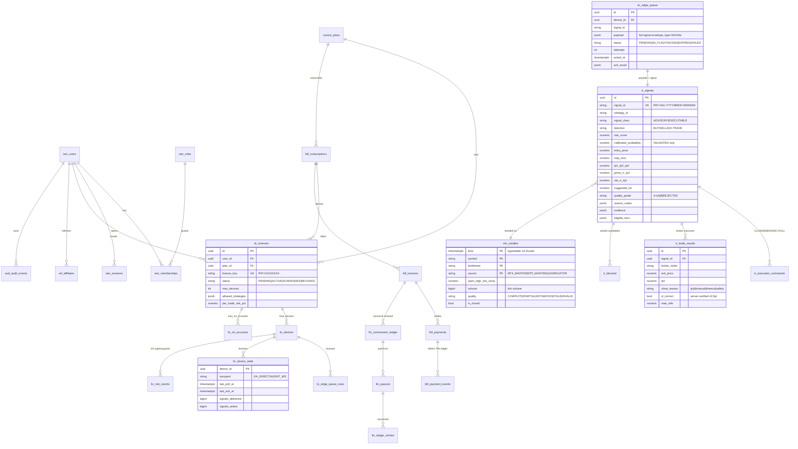

# Predict-A-Trade — Project Brief (project-brief.md)

The complete project reference: architecture, every service, the full
tick→signal→delivery→execution lifecycle, all the mathematics (scoring,
calibration, cost, sizing, tier viability), the signal object field by field,
delivery internals, database schema + relationships (ERD), flowcharts,
operations, and safety rules — followed by a plain-English Part II.

Companion files: **indicator.md** (indicator maths & evidence scoring in
depth), **docs.md** (plain-words pipeline). This file is the whole-project
brief. Sources: repo code + `README.md`, `MANIFEST.md`, `AGENTS.md`,
`docs/` (ARCHITECTURE, DATABASE_ARCHITECTURE, DB_ERD, API_REFERENCE,
RISK_GATES, CAPITAL_TIERS, STRATEGY_PLAYBOOKS), `docker-compose.yml`,
`docs.md`. Version: **v1.29.x** (live structured-log pin: realtime v1.24.2).
Repo: `/srv/predictatrade/xauusd` → `github.com/simhaonline/predictatrade`
(main).

---

# Part I — Precise Reference

## 1. What Predict-A-Trade is

A multi-plane XAUUSD (gold) trading **signal platform**:

- **One brain** — a Go realtime engine: ingests broker ticks, builds candles,
  computes 42 indicators, runs 7 strategy engines, scores evidence, calibrates
  probability, applies hard risk gates, sizes risk, and emits signals.
- **Thin edge** — MetaTrader 4/5 Expert Advisors on traders' Windows machines.
  Master EAs stream market data up; Client EAs poll for executable signals and
  place orders **on the trader's own broker account**. Money never transits
  the platform.
- **SaaS wrapper** — NestJS control plane: IAM/MFA/RBAC, USDT-only
  subscriptions (NOWPayments), licensing/devices, referrals/commissions/payouts.
- **Presentation** — Next.js dashboards (user portal + admin console) rendering
  server truth; they never recompute risk, indicators or entitlement.

**Status (honest):** GO for paper/sandbox/advisory signal operation. Live
trading arming was authorized by the operator (2026-08-30,
`LIVE_TRADING_AUTHORIZED=true` in `infra/env/realtime.env`), but
capital-protection gates remain **fail-closed**: signals stay ADVISORY unless
a verified broker equity/order feed exists. No profitability/accuracy claims
are published without evidence.

## 2. The five planes (hard boundaries)

| Plane | Tech | Authority | Never does |
|---|---|---|---|
| Real-Time Trading | Go 1.25 (`realtime/`) | market-data, features, strategies, signals, risk gates, execution authorization, delivery, reconciliation | no sync billing/referral/commission/payout in the tick path |
| Research/Intelligence | Python (`research/`) | datasets, backtesting, walk-forward/OOS, calibration, ML training | never a mandatory per-tick dependency |
| SaaS/Control | NestJS 12 (`control/`) | IAM/MFA/RBAC, subscriptions, billing, licensing, devices, referrals, commissions, payouts, audit | never computes trading signals |
| Presentation | Next.js 16 + React 19 (`frontend/`) | renders server-authoritative truth | never re-indicators / re-risk / re-entitlement / re-finance |
| MQL Edge | MQL4/MQL5 (`mql/`) | lightweight execution adapters + own safety guards | no primary intelligence, no server credentials in EAs |

## 3. Service inventory (Docker-first — systemd disabled)

Every command uses `docker compose --env-file infra/env/.env` (MANDATORY —
plain `docker compose up` starts with blank secrets and breaks the stack).

| Service | Container | Port | Role |
|---|---|---|---|
| Realtime engine | pat-realtime | 13081 | Go HTTP/WS signal engine (single port: REST `/api/v1/*`, WS `/ws/v1`, ingest `/ingest/agent`) |
| Control plane (HA pair) | pat-control / pat-control-b | 13080 | NestJS IAM/billing/licensing; nginx failover |
| Frontend | pat-frontend | 13082 | Next.js user + admin dashboards |
| Status page | pat-status | 13083 | Public status & compliance page |
| Backtest service | pat-backtest | 8088 (loopback) | Python walk-forward/OOS API |
| Live terminal | pat-live-terminal | 13090 | Bloomberg-style terminal |
| Mail relay | pat-mail-relay | 465/587 | Send-only SMTP (spool + retry) |
| PostgreSQL 17 + TimescaleDB | pat-postgres | 5432 | 16 schemas, 210+ tables, hypertables |
| Valkey 8 | pat-valkey | 6379 | Hot/cache state (never sole financial truth) |
| Nginx | pat-nginx | 80/443 | TLS, reverse proxy, WS routing, 10r/s/IP edge zone |
| Prometheus | pat-prometheus | 9090 | Metrics |
| Grafana | pat-grafana | 3001 | Dashboards (loopback) |
| ntfy | pat-ntfy | 8091 | Notifications (feed watchdog, alerts) |
| NATS | pat-nats | 4222 | Optional ingest-decoupling bus |
| Backup sync | pat-backup-sync | — | Hetzner S3 WAL + pg_dump off-host |
| Ollama | host | 11434 | LLM market-context (NOT_AI_VERIFIED provenance) |

Public domains: `platform.predictatrade.com`, `api.predictatrade.com`,
`live.predictatrade.com`, `downloads.predictatrade.com` (EA binaries),
`docs.predictatrade.com`, `pat.predictatrade.com` (mail relay).

## 4. End-to-end flowchart (tick → trade)

```
┌─────────────────────────────────────────────────────────────────────┐
│ EXTERNAL: MT4/MT5 terminals, TwelveData (macro), FMP (COT), Ollama  │
└─────────────────────────────────────────────────────────────────────┘
          │ MARKET_SNAPSHOT + MASTER_TICK
          │ POST /ingest/agent (Bearer device JWT, TYPE|{json} lines)
          ▼
   ┌──────────────┐
   │  NGINX :443  │ TLS terminate, rate zones, vhost routing
   └──────┬───────┘
          ▼
┌─────────────────────────────────────────────────────────────────────┐
│ GO REALTIME ENGINE :13081  (single process, single clock)           │
│  IngestBus (DirectBus | NatsBus) → AgentProvider                    │
│     ├─ tick goroutine → market.ticks                                │
│     └─ candle goroutine → aggregator → market.candles (bar_closed)  │
│           │ server receive time = truth (client clocks drift)       │
│           ▼                                                         │
│  per-TF Feature Registry (42 indicators) ──► Strategy engines (7)   │
│           │ evidence → score → grade          │                     │
│           ▼                                   ▼                     │
│  Calibration (VALIDATED only) ──► Signal engine + hard gates         │
│           │                     (deterministic, fail-closed)        │
│           ▼                                                         │
│  Risk sizing (lot, margin) ──► Capital-tier viability ──► SIGNAL     │
│           │                                                         │
│     trading.signals row (permanent record, FIRST)                   │
│           │                                                         │
│     ┌─────┴──────────────────────────┐                              │
│     ▼                                ▼                              │
│  WebSocket /ws/v1          enqueueSignalForDevices (SQL filter)      │
│  → Next.js dashboards      → licensing.edge_signal_queue             │
│                              (per eligible exec device)              │
└─────────────────────────────────────────────────────────────────────┘
          │                                        │
          ▼                                        ▼
┌───────────────────────┐            ┌──────────────────────────────┐
│ MT4/MT5 CLIENT EA     │◄──HTTPS───►│ CONTROL PLANE :13080 (HA)    │
│ (trader's terminal)   │  ~3s poll  │ edge-poll / edge-ack /       │
│ places order on OWN   │◄───────────│ edge-heartbeat (HMAC)        │
│ broker account        │            └──────────────────────────────┘
│ EXECUTION_ACK ────────┼─────────────────► reconciliation + SL check
└───────────────────────┘
```

Transport era: **Option B (v1.19.0)** — EAs talk directly to the cloud over
HTTPS. No Windows Agent, no port 13091, no `/ws/v1/agent`. Nothing open
inbound on the trader's machine. When the Master EA stops streaming the feed
reports `NO_DATA` — never a fake "live".

## 5. The Go realtime engine (internal map)

`realtime/cmd/realtime-engine/main.go` (6.4k lines) orchestrates; `internal/`
has 34 modules:

| Module | Role |
|---|---|
| `features/` | 42-feature indicator engine (per-TF registries), structure, liquidity, FVG, VWAP, SAR, Ichimoku, StochRSI, Fib, pivots, ORB, pullback, regime, MTF, session |
| `strategy/` | 7 strategies + geometry + regime thresholds + transition/range evidence |
| `signal/` | Decision engine, cooldowns, duplicate-bar idempotency |
| `gates/` | Hard gates (registry, short-circuit, fail-closed, per-(strategy,TF) state) |
| `marketdata/` | AgentProvider ingest, persister (candles/regime/indicators → DB) |
| `gateway/` | HTTP + WebSocket (pprof-enabled) |
| `calibration/` | Score → probability (VALIDATED-gated, hot-reloadable JSON models) |
| `capitaltier/` | MICRO/STANDARD/PRO banding + per-tier signal viability |
| `risk/` | Position sizing, margin-aware lot cap (R1/R7) |
| `ml/` + `pkg/mlengine/` | ONNX inference; `models/` watcher hot-reload (5 bootstrap models, honest `bootstrap-v1.0.0` label, NOT production-trained) |
| `rl/`, `sentiment/`, `adaptation/`, `recovery/`, `hedging/` | Advanced layers — additional fail-closed filters, never gate-weakening |
| `reconciliation/` | SignalRecord lifecycle tracking: delivered → acknowledged → filled → closed |
| `ptb/`, `igs/`, `astro/`, `crossmarket/`, `devilliquidity/` | Shadow/synthesis intelligence (calculate + persist; zero live score contribution unless activated) |
| `pkg/bus/` | Ingest decoupling seam (DirectBus in-process; NatsBus when NATS_URL set) |
| `pkg/math/` | Canonical Wilder maths (parity with Python `reference_math.py`) |
| `pkg/news/`, `pkg/macro/` | Economic-calendar risk engine; COT/DXY providers |

Performance: indicators in float64 with parallel window mirrors (~0.3 ms/bar
whole set; pprof-backed optimisation); decimal where money math happens.
Backtest parity: ~2.1M bars in ~5.5 min.

## 6. Data layer (ingest truth)

- Master EA POSTs `TYPE|{json}` lines (`MARKET_SNAPSHOT`, `MASTER_TICK`) to
  `/ingest/agent` via nginx. Engine validates symbol + sane price; **server
  receive time is the truth** (tick's own timestamp kept for reference —
  client PC clocks drift). `gateway_receipt_time` is stored on every tick.
- Ticks → `market.ticks` (27M+ rows, MT4_MASTER/MT5_MASTER share one table
  with a `source` column — migration 136 canonicalization).
- Candle building: M1, M5, M15, M30, H1, H4, D1, W1. OHLCV = first price,
  highest, lowest, last price, tick count. A candle is only used when
  **closed** (next period started). Aggregator rows carry `source=AGGREGATOR`.
- `market.candles` PK: `(time, symbol, timeframe, source)`; `quality` ∈
  COMPLETE/PARTIAL/ESTIMATED/STALE/INVALID; `is_closed` flag;
  `alignment_profile` (BROKER_ALIGNED_UTC_PLUS_3).

## 7. The mathematical layer (every formula the platform runs)

### 7.1 Indicator maths
Full formulas in **indicator.md** (EMA/SMA/MACD/OsMA, Wilder RSI/ATR/ADX,
Bollinger, Stochastic/StochRSI, CCI, SAR, Ichimoku, OBV, VWAP, structure
BOS/CHoCH, liquidity pools/sweeps, FVG/OB, Fibonacci, pivots, ORB, pullback,
regime classification, MTF weighted alignment). Canonical source:
`realtime/pkg/math/` + `realtime/internal/features/`, parity-tested against
`research/src/patresearch/reference_math.py`.

### 7.2 Evidence scoring (indicators → score)
```
evidence item  = (pillar, feature, direction BUY|SELL, contribution 0.03–0.18)
LongScore      = Σ BUY contributions × 100
ShortScore     = Σ SELL contributions × 100
dominance      = |LongScore − ShortScore| (must exceed MinDominanceMargin,
                 else NO_TRADE: conflicting direction)
conflict penalties on the dominant side:
  M1-vs-H1 / H4 contradiction +3 each · RANGE-regime trend trade +10
  countertrend without CHoCH/MSS +20 · spread/ATR > 0.5 +10
  penalty > 40 → WAIT (NTConflictingTimeframes)
regime thresholds (candidate / trade): TREND 10/25 · RANGE 15/45
  score ≥ trade → BUY/SELL (gate-evaluated)
  candidate ≤ score < trade → BUY_CANDIDATE / SELL_CANDIDATE (advisory)
  score < candidate → NO_TRADE
family caps: TREND .35 · MOMENTUM .30 · STRUCTURE .25 · LIQUIDITY/SMC/MTF/CANDLE .20
  · REGIME/VWAP/VOLATILITY/SESSION_ORB .15 · ML/SENTIMENT .25
AI add-ons (fail-open): ML (ONNX, conf>30) ±0.15 → ±2.25 on RawScore;
  LLM market-context −1..+1 ×5 on RawScore (once per bar, NOT news sentiment)
HTF veto: no BUY below H1 close, no SELL above it
```

### 7.3 Score → honest probability (calibration)
```
x = clamp(score, 0, 100) / 100
probability = 1 / (1 + e^−(a·x + b))            (sigmoid, per-strategy a/b)
```
- a/b learned from real resolved outcomes (live calibrator retrains from
  closed trades + shadow outcomes; JSON models hot-reload into the engine).
- Only `VALIDATED` or `PROMOTED` models surface probability; anything else →
  `ProbabilityCalibrated=false` and subscribers never see a fabricated number.
- Identical maths in the backtest engine (offline/live parity).

**Win-rate approximation inside the EV gate:**
```
winRate = 0.5 + (score − 55)/100 × 0.5
        + 0.05 (trend/breakout) | +0.02 (range/mean-rev) | −0.03 (high vol)
clamped to [0.35, 0.82]
```

### 7.4 Cost model & expectancy (behind the RR/cost/profitability gates)
```
roundTripCost = spread + slippage (0.10 pts) + commission (0.06 pts)
netWin        = TP distance − cost
netLoss       = SL distance + cost
netRR         = netWin / netLoss                 → must be ≥ 0.5
EV per 1R     = winRate × netWin − (1 − winRate) × netLoss  → must be > 0
GrossRR(TPx)  = |TPx − Entry| / |Entry − SL|
NetRR(TPx)    = (TP dist − cost) / (SL dist + cost)
ExpectancyR   = P(win)·AvgWinR − P(loss)·AvgLossR − CostR
```

### 7.5 Trade geometry (SL/TP)
```
effectiveATR = ATR14 × VolatilityScale (2.0; per-symbol override)
             raised so SL ≥ MinSLSpreadMult (3.0) × spread
percentage exit profiles (DB StrategyExitSpec) override ATR multipliers
SL/TP distances capped at 5% of entry
SL side enforced (wrong-side SL corrected defensively; gate also vetoes)
per-strategy ATR multipliers: ULTRA 1.0/1.5/2.5/4.0 · SCALP 0.8/1.2/2.0/3.5
  SWING 2.0/3.0/5.0/8.0 · TREND 2.5/4.0/6.5/10.0 (SL/TP1/TP2/TP3)
Micro-TP partial closes: ULTRA 50% @0.5×ATR · SCALP 40% @0.8 · SWING 35% @1.2
  · TREND 30% @1.8 · EQFE 40% @0.7
micro-TP value ≥ roundTripCost × buffer  (else MICRO_TP_UNPROFITABLE veto)
```

### 7.6 Risk sizing (R1–R7, `realtime/internal/risk/sizing.go`)
```
riskPerLot    = SL_distance / tickSize × tickValue      ($ per 1.0 lot)
maxRisk$      = equity × riskPctOfEquity / 100          (plan cap 1.5% default)
SuggestedLot  = floor(maxRisk$ / riskPerLot / lotStep) × lotStep
              → 0 if below lot minimum (account too small for this stop)
RiskDollars   = riskPerLot × lot;  RiskPctOfEquity = Risk$/equity × 100
RequiredMargin = lot × contractSize × price / leverage
marginBudget   = freeMargin × 30% (max usage)
margin OK ⇔ RequiredMargin ≤ marginBudget
  leverage unknown → FAIL CLOSED (no trade) — leverage must come from the
  client's broker snapshot, never assumed
oversized request → safe (capped) lot replaces it; veto only when no viable lot
```

### 7.7 Capital-tier viability (who may receive the signal)
```
minLotRisk$ = SL_distance_points × $1/point (0.01 lot XAUUSD ≈ $1/point)
cap$ = tierReferenceEquity × PerTradeRiskCapPct / 100
tier eligible ⇔ minLotRisk$ ≤ cap$
```
v1.25 combined tier model (user-approved a+b+c):

| Tier | Equity band | Ref equity (band floor) | Cap % | Cap $ | Admits |
|---|---|---|---|---|---|
| MICRO | < $500 (floor $100) | $100 | 4% | $4 | ULTRA scalps (SL ≈ 3.6 pts calm) |
| STANDARD | $500–4,999 | $500 | 5% | $25 | tightened swings (≈8 pts) + scalps + TREND (13.5) |
| PRO | ≥ $5,000 | $5,000 | 2% | $100 | full catalog incl. wide trend stops |

Effective per-trade cap = **min(plan per_trade_risk_pct, tier cap)** — the
plan cap can only tighten. Reference equity is the band FLOOR so eligibility
is guaranteed for every member of the tier. Exclusions recorded per tier
(`min_lot_risk_exceeds_tier_cap`) for audit. (Historical note: docs.md PART 6
shows the pre-v1.25 2%-flat numbers; `capitaltier/tier.go` is current truth.)

## 8. The Signal object (field groups, `internal/types/types.go`)

| Group | Fields |
|---|---|
| Identity | ID (uuid), SignalReferenceID `PAT-XAU-YYYYMMDD-NNNNNN`, Symbol, StrategyID, StrategyDefinitionID, Direction, Grade |
| Scores | RawScore, LongScore, ShortScore, ConflictPenalty, CandidateThreshold, TradeThreshold |
| Probability | CalibratedProbability, Probability, ProbabilityCalibrated (never fabricated) |
| Geometry | EntryPrice, EntryZoneLow/High, StopLoss, TP1/2/3, GrossRR TP1-3, NetRR TP1/2/3, ExpectedCost, EntryType (MARKET/LIMIT/STOP) |
| Micro profit | MicroTP, PartialClosePct, EdgeScore, ExpectedValue, IsLossCandidate |
| Context | Regime, Session, NewsRisk, Timeframe, TTL, Status, ReasonCodes, HumanReason, NextMarketOpen |
| Audit | Evidence[], GateResults[], RiskDecision, AiVerification, ExitProfileID, GatePolicyVersion |
| Versions | RegimeEngineVersion, StrategyVersion, ScoringVersion, GateConfigVersion, StrategyConfigVersion |
| Delivery | Executable, SignalClass (ADVISORY/EXECUTABLE), ShadowOnly, FailedProductionReason, EligibleTiers, SuggestedLot, RiskDollars, RiskPctOfEquity, SLDistancePoints |
| Timestamps (SOW 26–30) | MarketTime, MarketBarOpenTime, MarketBarCloseTime, DetectedAt, CandidateDetectedAt, QualifiedAt, PublishedAt, DeliveryQueuedAt, DeliveredAt, AcknowledgedAt, ExecutionSubmittedAt, BrokerFillAt |
| Exit lifecycle | ExitPrice, ExitReason (TP1/TP2/TP3/SL/TIMEOUT/MANUAL/SAFETY_EXIT/BROKER_CLOSE), ClosedAt, RealizedPnL, RealizedR |
| Quality | QualityGrade (A+/A/B/REJECTED), ExpectancyR (EV_R), ExpectancyScore (0–100) |
| Rejection | PrimaryRejectionReason, RejectionReasons |

Timestamp discipline: stages are populated only when they occur — the full
chain `MarketTime → … → BrokerFillAt` doubles as the per-signal latency audit.

## 9. Risk gates (the veto wall)

16 ordered server gates (per-(strategy, timeframe) isolated cached state,
short-circuit, fail-closed):
`ExecutionPermission → BrokerSymbolValidation (P0) → SeedCapitalProtection
(5% daily cap) → DailyLossLimit → MaxSpread → NewsRisk → Slippage →
MaxPositions → MaxExposure → Cooldown → StopHuntFilter → MarginCheck →
OvertradeProtection → MaxDailyTrades → RegimeFilter → ProfitTarget`.

Plus the capital-gate set evaluated by the signal engine:
wrong_side_sl · risk_oversize (1.5% default; sizes down when viable) ·
position_caps · daily_loss (2%/4%/5% d/w/m) · profit_target (5%/12% d/w;
equity anchors re-anchor on ≥50% equity jumps with zero open positions) ·
martingale_ban · edge_validation (live vs backtest drift) · min_atr ·
rr_net_expectancy · profitability · data_quality · entitlement · license ·
total_cost · stop_hunt_filter (structural distance ≥ 1.5×ATR).

A veto preserves the thesis direction on the dashboard with reason codes but
`Executable=false` — vetoed signals are never delivered to any EA.

## 10. Signal delivery (full detail)

Two transports coexist; delivery is **store-then-deliver, at-least-once**:

1. **Signal row first:** every decision is persisted to `trading.signals`
   (permanent record) — including NO-TRADEs with reason codes.
2. **Dual transport:** browsers/devices on the WS hub get real-time push;
   EA-direct devices get the durable queue. `enqueueSignalForDevices` runs
   for every EXECUTABLE signal.

### 10.1 Enqueue (SQL entitlement filter, engine side)
`INSERT INTO licensing.edge_signal_queue (device_id, signal_id, payload)
SELECT … FROM licensing.devices d
  JOIN licensing.licenses l ON l.id = d.bound_license_id
  LEFT JOIN control.plans p ON p.id = l.plan_id
  LEFT JOIN licensing.edge_device_state eds ON eds.device_id = d.id
 WHERE d.revoked_at IS NULL
   AND d.role = 'exec'                      -- trade signals to exec devices only
   AND l.status IN ('ACTIVE','PENDING')
   AND (license.allowed_strategies matches strategy)
   AND (plan.allowed_strategies matches strategy)
   AND NOT EXISTS (already queued for this device+signal)   -- idempotent
   AND (device tier unknown → deliver       -- v1.23 fail-open rules
        OR payload has no EligibleTiers → deliver
        OR device.capital_tier ∈ payload.EligibleTiers)`

Payload = `json.Marshal(signal)` + injected `"type":"SIGNAL"` (v1.24.1 —
older EA builds dispatch by payload type; a type-less item was ACKed but
silently never executed). A 0-device match is logged loudly (v1.24.2) so a
tier/entitlement filter excluding the whole fleet is diagnosable from logs.

### 10.2 Queue state machine
```
            ┌────────────── reclaim (IN_FLIGHT > 30 s, attempts < 50)
            ▼
PENDING ──► IN_FLIGHT ──► ACKED (ack_result stored)
   │            │
   │            └──► EXPIRED (attempts ≥ 50 → dead-letter)
   ▼
EXPIRED (past signal TTL at poll time)
FAILED (delivery error)
```
`edge-poll` per call: dead-letter stale rows (≥50 attempts) → EXPIRED;
reclaim stale IN_FLIGHT (>30 s, EA crashed mid-batch) → PENDING; expire
PENDING rows whose payload TTL has passed (also drops rows whose license is
no longer ACTIVE); select oldest PENDING (max 1–20, default 10), mark
IN_FLIGHT with `attempts+1`. **At-least-once delivery — the EA dedupes by
signal ID.**

### 10.3 Auth: Proof-of-Device HMAC
Headers: `X-Device-Id`, `X-Device-Timestamp` (unix ms), `X-Device-Nonce`
(unique), `X-Device-Signature`:
```
hex( HMAC_SHA256( device_secret,
  "v1\n<timestamp>\n<nonce>\nPOST\n<path>\n<sha256(body)>\n<device_id>" ) )
```
Path is the full API path (e.g. `/api/v1/devices/edge-poll`). Server verifies
timestamp window + nonce replay protection + device revocation + license
state. edge-poll is **exempt from the global 300/min throttle** (machine
polling, 2026-09-02 429-storm incident) — abuse is bounded per-device by HMAC
identity + nginx 10r/s/IP.

### 10.4 Endpoints (control plane, `edge-poll.controller.ts`)
| Endpoint | Purpose |
|---|---|
| `POST /api/v1/devices/edge-poll` | hand PENDING signals+commands to the device, mark IN_FLIGHT (always-ACK protocol; ~3 s cadence) |
| `POST /api/v1/devices/edge-ack` | device reports execution result per queue item → status ACKED, `ack_result` stored; `edge_device_state` counters updated |
| `POST /api/v1/devices/edge-heartbeat` | device liveness |

### 10.5 Liveness & liveness counters
`licensing.edge_device_state` per device: transport (EA_DIRECT | AGENT_WS),
last_poll_at, last_ack_at, last_heartbeat_at, polls_total, signals_delivered,
signals_acked. A device silent for ~3 minutes triggers the connectivity
watchdog (alert + runbook: `docs/runbooks/mt-connectivity-502.md`).
Measured live: **88% of ACKs < 10 s**; slow tail = offline devices ACKing on
reconnect (expected).

### 10.6 Execution reconciliation & server-side SL enforcement
- `EXECUTION_ACK` verification: SL > 0 and matches server-sent value (±0.5 pt).
- Position monitor: broker snapshot scanned for PAT positions with missing SL
  → `CLOSE_POSITION` command (per ticket/magic).
- `EMERGENCY_STOP`: close ALL PAT positions + halt trading.
- `KILL_SWITCH`: close all + `ExpertRemove()` + disconnect.
- 3 SL violations → device suspended **via disconnection** (delivery not
  broadcast-filtered; other devices unaffected).
- Reconciler tracks every signal: recorded → delivered → acknowledged →
  filled → closed, with `UnacknowledgedOlderThan` / `UnfilledOlderThan` sweeps.

### 10.7 EA-side safety (defence in depth on the client)
- Price-drift gates per tier: ULTRA 15 / SCALP 25 / SWING 60 / TREND+others
  80 points — skip if price ran from entry before the EA acts.
- TTL expiry per strategy (5–240 min) anchored on payload server-issue time
  (replays can't reset TTL); stale signals auto-dropped.
- Own spread + margin checks; server-command envelope handling; license
  token self-heal on refresh-401; EA capital guards (floating-DD breaker /
  soft halt / recover → `licensing.device_risk_events`, migration 138).

## 11. Strategies (7)

| Engine | Internal ID | Decision TFs | Min score | Expiry | Mode |
|---|---|---|:--:|:--:|:--:|
| Standard Scalping | STANDARD_SCALPING | M1/M5 | 65 | 10m | LIVE (v1.26 rebuild: wr 57.4%, PF 1.30) |
| Ultra Scalping | ULTRA_SCALPING | M1 | 60 | 5m | LIVE |
| Standard Swing | STANDARD_SWING | M15/H1 | 68 | 30m | LIVE |
| Trend Swing | TREND_SWING | H1/H4 | 70 | 60m | LIVE |
| EQFE | MARNIE_FIB | H1 | 70 | 60m | SHADOW→LIVE |
| ATEN | ATEN (astro-confluence) | H1/H4 | 70 | 60m | LIVE |
| IMLR | (internal) | M5/M15 | 70 | 180m | ADVISORY-only |

- Display rule: internal IDs `MARNIE_FIB`/`ARCANIST` never user-facing —
  rendered as **EQFE**/**IMLR** everywhere; DB/signals keep internal IDs.
- Plan entitlement (server-enforced): FREE → STANDARD_SCALPING (max 5
  signals/day); STANDARD → + STANDARD_SWING; PRO → core 4; ELITE → all 7.
- IMLR delivers ADVISORY-only until validation/backtesting completes.
- Playbook Confirmation Gate (last-mile checklist) applies to all strategies.

## 12. Control plane (NestJS) — 25 modules

`auth` (JWT + TOTP MFA; trusted-device "remember" issues a `pat_trusted_device`
HttpOnly cookie — 30d, single-use rotation, sha256-hashed in `iam.trusted_devices`;
TOTP skipped on remembered browsers, password always required; 5 failed logins
lock the account), `users`, `plans`/`subscriptions`/`billing` (USDT-only via
NOWPayments; Stripe controller-disabled; HMAC-SHA512 timing-safe IPN +
`payment_status ∈ {confirmed, finished}` + amount verification else UNDERPAID
+ exact-key dedupe `provider_event_id = payment_id:status`),
`licensing` (licenses PAT-XXXXXXXX, devices, MT accounts, entitlement leases,
`strategy_parameters`, `policy_config`, `strategy_cost_gates`),
`device-auth` (activation, refresh, heartbeat, sessions, revoke),
`edge-poll` (EA-direct delivery), `backtest`, `commissions` (rules, caps,
hold/release), `payouts` (idempotency keys), `referrals`,
`operations` (halt-trading, pause-signals, per-strategy kill switch, model
activation — cannot self-promote), `admin`, `admin-extras`, `audit`,
`health`, `market-proxy`, `monitoring`, `feature-flags`, `guest-preview`
(anonymous 5-min funnel), `compliance` (GDPR erasure), `brokers`, `reports`.

Money math: `NUMERIC(18,8)` / `NUMERIC(10,4)` in Postgres; decimal.js in the
control plane; append-only ledger (corrections = compensating/reversal rows).

## 13. Database — schema, relationships, ERD

PostgreSQL 17 + TimescaleDB HA + pgvector + pgcrypto. 100 migration files
(unique prefixes, numbered to 138, forward-only, all applied;
`scripts/check_migrations.sh` reconciles `audit.migration_history`).
16 application schemas, 210+ tables, 232 CREATE TABLE statements, 112
distinct table names in migrations.

### 13.1 Schema map

| Schema | Purpose | Key tables |
|---|---|---|
| `iam` | identity, RBAC, sessions, MFA, consent | users, roles, memberships, sessions, login_events, api_credentials, consent_records, trusted_devices |
| `licensing` | licences, devices, edge transport | licenses, devices, license_devices, device_activations, device_credentials, mt_accounts, mt_connections, entitlement_leases, license_events, client_releases, edge_signal_queue, edge_device_state, device_risk_events, strategy_parameters, policy_config |
| `billing` | subscriptions, invoices, payments | subscriptions, invoices, payments, coupons, subscription_events, payment_events |
| `finance` | commissions, payouts, ledger | commission_ledger, commission_rules, commission_caps, payouts, ledger_entries, affiliate_wallets |
| `control` | plans + commercial flags | plans, commercial_feature_flags, platform_operations |
| `referral` | affiliate tree + risk | affiliate_profiles, affiliate_risk_flags, referral_* |
| `trading` | signals, execution, results, intelligence | signals, signal_delivery_ledger, signal_outbox, signal_candidates, blocked_signals, trade_results, execution_commands, exit_profiles, strategy_evaluations, indicator_history, regime_history/transitions, bar_processing_log, cooldown_audit, duplicate_audit, slippage_events, capital_protection_events, oco_groups, shadow_signals, signal_performance, signal_rejections, recovery_states, adaptation_history, hedge_positions/history, rl_training_history, sentiment_snapshots/items, ptb_* (3), igs_* (3), cross_market_* (8), cot_* (7), backtest_* (7), broker_execution_profiles, sl_modification_history |
| `market` | time-series + macro | candles (hypertable), ticks, market_states, flow_features, session_definitions, holiday_calendars, gold_fix_windows, futures_contracts, futures_roll_calendar, broker_execution_profiles, economic_events, cot_* mirrors, data_provider_capabilities, data_metadata |
| `calibration` | model registry | calibration_profiles, calibration_reports, model_versions |
| `ptb` / `ai` | PTB + ML artifacts | ptb_feature_flags, ai.* |
| `compliance` | GDPR + telemetry | gdpr_operations, client_event_log |
| `audit` | audit + migration history | audit_events, client_events, migration_history |
| `research` | parity studies | feature_parity_runs |
| `live_preview` | anonymous funnel | anonymous_trials, funnel_stats |
| `support` | tickets | support.* |

### 13.2 Entity relationships (core domains, mermaid)



### 13.3 Invariants
- Money: NUMERIC(18,8)/NUMERIC(10,4), never float; append-only finance
  (compensating/reversal rows, never UPDATEs).
- Time: TIMESTAMPTZ everywhere; UTC internal truth; broker wall time is a
  display/hour-of-day conversion only.
- Hypertables + retention: `market.candles` (1-day chunks, per-TF policies,
  migration 081), `audit.client_event_log` (064), `market.cot_raw_reports` (7d).
- Valkey is cache/hot-state only — never sole durable truth.
- GDPR: `iam.users.anonymized_at` + `compliance.gdpr_operations` (088).
- USDT-only settlement: HMAC-verified IPN + exact-key dedupe + status
  `{confirmed, finished}` + amount verification (else UNDERPAID + audit row +
  no activation).

## 14. Frontend (Next.js 16 + React 19)

User dashboard (19 routes): signals (paginated 15/page, TP1/TP2/TP3 with
per-level R:R, quality grades, EV_R/ExpectancyScore, capital-protection
sizing in expandable rows), live command center, strategies, backtest,
billing, payouts, referrals, mt4-mt5-client, security, settings,
signal-accuracy, trading-reports, activity-log, notifications, support.
Admin console (25+ routes): signal-engine, indicators/indicator-monitor,
market-data, macro-news/macro-intelligence, astro/aten, backtesting,
devil-liquidity, agent-mesh, device-auth (+ device risk events panel),
licenses, activations, mt-accounts, brokers, broker-qualification, billing/
payments, commission-control-center/operations, payout-operations,
finance-referral-reports, users/logs/health, operations, ai-providers,
feature-flags, backup-dr.

UI rules: render server truth; never recompute indicators/risk/entitlement/
money; honest loading/empty/stale/degraded/demo states; timestamps rendered
on the broker clock (`formatBrokerTimestamp`), never the browser's timezone.

## 15. MQL edge (pure MQL, self-contained)

4 EAs, ~11.8k lines: Client `PredictATrade_MT4.mq4` (3.9k) /
`PredictATrade_MT5.mq5` (4.0k); Master `PredictATrade_MasterNode_MT4/5`
(1.8k / 2.1k — MT4/MT5 Master streams share one `market.*` table via the
`source` column). Mandates: PURE MQL (no external scripts, no .mqh, no file
reads); cloud transport via the EA's HTTPS client; ALL trading logic on
broker time `TimeCurrent()`; DST-adaptive `PAT_UTCToBrokerWall` /
`PAT_LocalToBroker` bridges (zero hardcoded offsets); TTL anchored on payload
`CreatedAt`; token self-heal on refresh-401. Compiled in MetaEditor
(Windows); user pastes error.log for fixes.

## 16. Research plane (Python)

`research/src/patresearch/`: indicators, backtester, backtesting, dataset,
calibration, ml_training, rl_training, quantitative_strategy_engine,
liquidity, ai_research, reference_math (canonical parity source for Go).
154 tests (152 pass, 2 skip) via `uv run pytest`. Walk-forward/OOS discipline
(`oos_walkforward_calibrate.py`, `quant_validation.py`); models/optimizers
cannot self-promote (`strategy_change_gate.py`).

## 17. Operations & observability

- Build/test: `make test / lint / build / format`; Go in `golang:1.25`
  container (host has no toolchain); frontend `tsc --noEmit` + jest + 18 e2e;
  control 14 suites/174 tests; research 154 tests.
- Deploy: `docker compose --env-file infra/env/.env build <svc> && up -d <svc>`.
- Migrations: `./scripts/migrate.sh up` — forward-only, never auto-applied,
  never rewrite applied history.
- Metrics: OpenTelemetry + Prometheus + Grafana; gate p50/p95/p99, ingest/
  signal/delivery latency, WS reconnects, ingest bus depth, broker execution
  quality, calibration drift, API/DB/Valkey health.
- Ops scripts: `full_audit.sh`, `security-scan.sh` (gitleaks), `go_live.sh`,
  `final_go_live_check.py`, `backup_restore_validate.py`,
  `reconcile_migrations.sh`, `benchmark_latency.sh`, `setup_crons.sh`.
- Backup/DR: WAL streaming + pg_dump → Hetzner S3 (off-host), restore
  validation script, runbooks in `docs/operations/`.
- Time model: UTC truth; broker GMT+2 winter / GMT+3 summer (Equiti,
  DST-following) observed live from Master tick offset (authoritative);
  `/health` reports `time_mode: BROKER_ALIGNED` + `broker_offset`.
- Watchdogs: silent-feed monitor (10 s, data-independent, ntfy alert +
  REQUEST_SNAPSHOT nudge), connectivity watchdog (3-min poll silence),
  migration reconciliation (CI-enforced).

## 18. Learning loop

1. Closed trades + shadow outcomes persisted with full feature snapshots.
2. Live calibrator retrains sigmoid a/b per strategy from resolved outcomes;
   writes JSON; engine hot-loads VALIDATED models only.
3. Edge-validation gate compares live vs backtest expectancy; drift beyond
   tolerance vetoes new signals (protects clients from a decayed edge).
4. Backtest engine shares the identical maths (0.3 ms/bar) so backtest and
   live probabilities use the same formulas.

## 19. Non-negotiable rules (AGENTS.md)

1. Safety precedence outranks everything: data quality → hard risk vetoes →
   news/session → cost limits → margin/exposure → broker constraints →
   license/entitlement → TTL/idempotency → emergency stop → ledger
   correctness → security.
2. **NO-TRADE is a first-class result.** Never force trades for frequency.
3. **Never fabricate** ticks, fills, P&L, order flow, CVD/DOM, confidence,
   probabilities, performance claims, AI activity. Demo/replay unmistakably
   labeled.
4. Production mutation boundary: no live orders, financial mutations,
   destructive migrations, key rotation, secret exports, DB superuser, DNS
   changes without explicit operator authorization.
5. Auto-push after every change; docker-first; `--env-file` mandatory.
6. Raw score is not probability (calibration-gated).
7. Financial truth exact-decimal, transactional, idempotent, ledger-backed.

## 20. Key numbers (v1.29)

| Metric | Value |
|---|---|
| Go tests | 39 packages pass (container toolchain) |
| Python tests | 154 (152 pass, 2 skip) |
| Frontend tests | 84 + 18 e2e; tsc clean |
| Control tests | 14 suites / 174 pass; tsc clean |
| DB migrations | 100 files (prefixes to 138), all applied |
| Tables | 210+ live across 16 schemas (112 in migrations) |
| Indicators | 42 (35 live, 7 warming) |
| ML models | 5 (bootstrap placeholders, honest label) |
| Strategies | 7 (IMLR advisory-only) |
| Gates | 16 ordered + capital set + EA-side guards |
| Edge EAs | 4 files, ~11.8k lines MQL |
| API latency | < 3 ms |
| Delivery | 88% of ACKs < 10 s (live measured) |

---

# Part II — Plain-English Guide (the whole platform in plain words)

## 21. The one-paragraph version

Predict-A-Trade watches gold prices from real broker terminals, thinks about
them with 42 indicators and 7 strategies, and — only when enough evidence
agrees AND every safety check passes AND the trade even fits the receiving
account's size — drops a small instruction card ("buy here, stop here,
targets here") into a per-device queue that the trader's MetaTrader EA picks
up every few seconds and executes on the trader's own account. The platform
sells access by subscription, tracks licences/devices, pays referral
commissions from an append-only ledger, and shows everything on web
dashboards. It refuses to trade far more often than it trades — by design.

## 22. The cast of characters

| Piece | Plain role |
|---|---|
| Master EA | A microphone in a real MT4/MT5 terminal — streams every price up to the cloud |
| Go engine | The brain — ticks → candles → measurements → opinions → decisions |
| Strategy engines | Seven specialists (quick scalper, patient swing trader, fib reversal specialist…) |
| Calibration | The honesty layer — turns opinions into probabilities only when mathematically validated |
| Risk gates | The bouncer — 20+ checks every trade idea must survive |
| Capital-tier maths | The fitting room — decides which account sizes this trade even fits |
| Delivery queue | The post office — holds approved cards per device until picked up |
| Client EA | The hands — picks up cards and clicks the buttons on the trader's own account |
| Reconciliation | The auditor — verifies the stop was really set; closes anything unprotected |
| Control plane | The back office — accounts, subscriptions, licences, devices, payouts |
| Web dashboards | The windows — show what's happening, decide nothing |
| Postgres/Timescale | The memory — every tick, candle, signal, payment, audit event |
| Valkey | The sticky notes — fast hot state, never the source of truth |

## 23. A signal's life, told simply

1. **A tick arrives** from a Master EA. The engine stamps its own clock (PC
   clocks drift) and files the tick.
2. **Candles form** per timeframe; only fully closed bars are ever used.
3. **42 indicators update** for that timeframe, each in its own room.
4. **Strategies vote:** each strategy collects buy-evidence vs sell-evidence
   and produces direction + score. Usually the honest answer is NO-TRADE.
5. **Calibration (only if a validated model exists):** score → probability.
   No validated model → no probability shown, ever.
6. **Gates filter:** spread, news, margin, daily loss, proven-losing edge…
   any single no → blocked but displayed with its reason.
7. **Sizing:** entry, stop, three targets, a risk-appropriate lot that also
   respects the margin budget, and which account-size bands the trade fits.
8. **Record, then deliver:** the signal row is written first; executable
   signals are then queued per-device in SQL — only devices with an active
   licence whose plan includes the strategy, in an eligible capital tier.
9. **The EA polls every ~3 seconds** with a signed request, picks up the
   card, checks its own drift/spread/TTL gates, and trades it on the
   trader's own account.
10. **ACK + audit:** the EA confirms; the server marks the queue item ACKED,
    verifies the stop matched, monitors the position, and can close
    unprotected positions by command. Three violations → device disconnected.

## 24. The delivery queue, explained like a post office

- The engine writes one **permanent record** of every decision (including
  refusals) — that's the archive.
- Approved cards are then **photocopied per recipient**: one queue row per
  device, each stamped with the full signal as JSON (`type: SIGNAL`).
- Photocopying has rules: no revoked devices, execution-role devices only,
  licence ACTIVE/PENDING, licence and plan must both allow the strategy, no
  duplicate copies, and the recipient's account-size band must appear on the
  card's "fits these accounts" list (`EligibleTiers`).
- The EA asks "anything for me?" every ~3 seconds with a **handwritten
  signature** (HMAC of timestamp + nonce + request) the server can verify
  without the EA ever sending its secret.
- Handed-out cards go to "handed out" (IN_FLIGHT). If the EA crashes
  mid-handover, the server puts unclaimed cards back after 30 seconds.
  Cards nobody ever claims (an old EA that doesn't understand them) are
  dead-lettered after 50 attempts instead of looping forever.
- Every card carries a use-by time (TTL). Expired cards are destroyed at
  pickup time — stale trade ideas are never executed.
- The ACK is the receipt: it stores the result (fill/reject + latency) on the
  card and updates the device's counters.
- If a device stops asking for ~3 minutes, the watchdog raises a hand.

## 25. The maths, in plain words

- **Score:** witnesses add up. Each indicator contributes a small number
  (0.03–0.18) to the buy or sell jar; multiply by 100 for a 0–100 score.
  The two jars must differ enough (dominance) or it's "conflicting direction".
- **Thresholds:** the bar to clear depends on the weather (regime) — trend
  markets can produce 75–90; ranges can only produce ~47. So the trend bar is
  25 and the range bar is 45. Matching the bar to the budget, not lowering it.
- **Probability:** score is an opinion; the sigmoid turns it into a %
  — but only after a model trained on real outcomes is validated. No
  validated model → no % shown.
- **Cost:** every round trip pays spread + slippage + commission
  (~0.10 + 0.06 points). Targets shrink by cost; stops grow by cost. Net
  reward:risk must be ≥ 0.5 and expected value must be positive, else veto.
- **Geometry:** the stop is a multiple of ATR (gold's normal breathing room),
  scaled up so it can never be thinner than 3× the spread — costs alone can
  never stop you out. Take-profits are bigger multiples; every distance is
  capped at 5% of price so a corrupted number can't create an absurd target.
- **Lot size:** riskBudget = equity × 1.5%; lot = budget ÷ ($ risk per lot);
  floored to 0.01 steps; margin check ≤ 30% of free margin (leverage from
  the trader's own broker snapshot — if unknown, no trade).
- **Tier fit:** the smallest account in a band must be able to afford the
  stop: min-lot risk in dollars vs the tier's cap (MICRO $4, STANDARD $25,
  PRO $100). A $100 account is never handed a trade that can cost $22.
- **Micro profit-taking:** the first tiny target must at least pay the bill
  (spread + slippage + commission) — "cover the broker fee" enforced in
  maths, not hope.

## 26. Why the architecture is shaped this way

- **Money never transits us.** The platform sends numbers; the trader's own
  broker, account and risk stay theirs. No custody business, no pooled funds.
- **One brain, thin edge.** Intelligence is central (fixable, auditable,
  versionable, rollbackable). The EA is deliberately simple plus its own
  safety guards — nothing worth stealing, nothing to sync.
- **Fail closed everywhere.** Stale data, unknown leverage, unresolved plan,
  errored gate — every form of doubt means "don't trade".
- **Honesty as a feature.** No fake ticks, fake "live" badges, invented
  win-rates, fabricated probabilities or AI theatre. Labels like
  `bootstrap-v1.0.0` and `NOT_AI_VERIFIED` exist because trust is the product.
- **Planes can't corrupt each other.** A billing bug can't pause signals; a
  dashboard bug can't re-risk a trade; a Python experiment can't join the
  live tick path.
- **Everything replays.** Full evidence, gate results, versions and
  timestamps ride on every signal, so any past decision can be reconstructed.
- **Two independent walls before execution.** Server gates decide
  trade-worthiness; the SQL entitlement filter + poll-time re-check decides
  delivery; the EA's own gates decide execution. No single point of failure
  can put a bad trade on an account.

## 27. Who sees what (commercial model)

- **Plans:** FREE (one strategy, max 5 signals/day) → STANDARD (+ swing) →
  PRO (core 4) → ELITE (all 7). Visibility enforced server-side.
- **Payments:** USDT via NOWPayments, HMAC-verified callbacks, underpayment
  handling; card payments deliberately disabled.
- **Licensing:** PAT-XXXXXXXX key → devices (MT4/MT5, master/client roles),
  max 6 devices per elite key, entitlement leases between polls.
- **Partners:** referral tree, commission ledger (rules, caps, holds,
  reversals), payout requests with idempotency keys.
- **Admin console:** halt/pause trading, per-strategy kill switches, signal
  engine telemetry, device risk events, indicator monitor, finance — an
  operations console, not a second trading terminal.

## 28. A day in the life

- **Broker Sunday open:** Master EAs reconnect, feed resumes, indicators
  warm up, first honest signals flow.
- **London/NY overlap:** all strategies active; ORB tracks opening ranges;
  spread/cost gates at their most protective.
- **News window (NFP):** calendar raises risk → strategies stand down
  (NTHighNewsRisk) — nothing trades through the spike.
- **Quiet Asia:** scores below candidate bars → NO-TRADEs and occasional
  BUY_CANDIDATE advisories. Correct behaviour.
- **Device offline:** heartbeats stop; queue holds items to TTL; watchdog
  alerts; nothing executes on a stale link; on reconnect, reclaimed items
  deliver (at-least-once + EA dedupe).
- **Losing streak:** daily-loss/seed-capital gates trip; the account stops
  receiving executable signals until cooldown — protection, not punishment.
- **Profitable day:** profit-target gate enters lock-in mode.
- **Nightly:** backups to Hetzner S3, retention trims, calibrator retrains,
  Grafana watches the gauges.

## 29. Glossary (project-level)

| Term | Meaning |
|---|---|
| Plane | Isolated technology domain with a hard boundary |
| Option B | v1.19.0 transport: EAs ↔ cloud directly; no Windows Agent |
| Master / Client EA | Data-streaming EA vs signal-executing EA |
| edge-poll | ~3 s HMAC-signed poll by which Client EAs receive signals/commands |
| edge_signal_queue | Per-device durable delivery queue (PENDING→IN_FLIGHT→ACKED/EXPIRED) |
| EligibleTiers | Per-signal list of account-size bands the geometry fits |
| Capital tier | MICRO <$500 / STANDARD $500–5k / PRO ≥$5k |
| EXECUTION_ACK | Client's execution confirmation; server verifies SL ±0.5 pt |
| Reconciliation | Lifecycle tracking: recorded→delivered→acked→filled→closed |
| At-least-once | Delivery guarantee; EA dedupes by signal ID |
| Dead-letter | Queue item failed 50+ attempts → EXPIRED, not re-queued forever |
| Calibration | Score → probability; only VALIDATED models surface a % |
| EV_R | Expected value per unit risk (includes costs) |
| EligibleTiers / Quality grade / EV_R | See indicator.md Part II glossary |
| Walk-forward / OOS | Out-of-sample validation discipline |
| Hypertable | TimescaleDB time-partitioned table |
| Fail closed | Doubt blocks action, never enables it |
| EMERGENCY_STOP / KILL_SWITCH | Close-all + halt / close-all + EA removal |
| Entitlement lease | Edge-side permission cache between control-plane checks |
| Drift gate | EA-side check: price moved too far from entry → skip |

## 30. FAQ

**Q: Is this live trading?**
Signals are live; execution happens on each client's own account via their
EA. Server-side arming exists but capital-protection gates keep everything
ADVISORY until a verified broker equity/order feed exists.

**Q: Where does price data come from?**
Master EAs in real MT4/MT5 terminals (Equiti XAUUSD) — authoritative.
Twelve Data/FMP are macro cross-checks. No fabricated ticks, ever.

**Q: What if the Master terminal goes offline?**
Feed honestly reports NO_DATA; dashboards show stale states; the watchdog
alerts via ntfy and nudges REQUEST_SNAPSHOT. No signals on stale prices.

**Q: Can two clients interfere with each other?**
No — per-device queue, per-client margin checks; one blown account never
blocks another's delivery.

**Q: What if the control plane dies?**
HA pair (pat-control + pat-control-b) with nginx failover; runbook for the
edge-poll 502 scenario.

**Q: How exactly does the EA authenticate?**
HMAC proof-of-device: signature over `v1\ntimestamp\nnonce\nPOST\npath\nbody-hash\ndevice-id`
with the device secret. Replay-protected by timestamp window + nonce.

**Q: What happens if a signal is delivered twice?**
At-least-once delivery means it can be; the EA dedupes by signal ID, and the
queue's per-device+signal uniqueness prevents duplicate enqueue in the first
place.

**Q: How do I deploy a change?**
Tests + lint first, build + up the service with the env-file, migrations
forward-only via migrate.sh, push immediately (auto-push rule).

**Q: Where are the indicator maths and the plain-words pipeline?**
`indicator.md` (deep maths), `docs.md` (plain-words pipeline), this file
(whole project). Canonical index: `docs/INDEX.md`.

---

*Maintainer note: keep this file in sync with MANIFEST.md, AGENTS.md, docs/
and the code. When services, strategies, gates, tiers, delivery mechanics,
schema, or deployment topology change, update this brief in the same commit.*